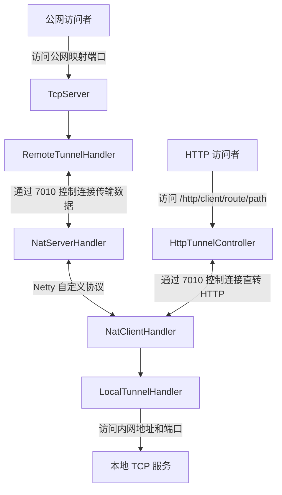

# shuai-tunnel

`shuai-tunnel` 是一个基于 Spring Boot 和 Netty 的 Java 内网穿透实验项目。它在公网服务端和内网客户端之间维护一条控制连接，并在收到映射配置后，将公网 TCP 端口上的流量转发到客户端可访问的本地服务。

> 当前仓库适合用于学习和继续开发，不建议直接用于生产环境。现有功能和待完善项详见[当前状态](#当前状态)。

## 工作原理



核心流程：

1. `tunnel-server` 启动 Spring Boot 应用，并在 `7010` 端口监听客户端控制连接。
2. `tunnel-client` 读取工作目录下的 `tunnelClientConfig.json`，连接服务端并完成登录。
3. 服务端向客户端发送 `NAT_CONTROL` 消息后，客户端动态添加 `NatClientHandler` 并注册端口映射。
4. 服务端为每个公网映射端口创建一个 `TcpServer`。
5. 公网请求到达映射端口后，数据经控制连接转发至客户端，再由客户端连接目标内网服务。

## 模块结构

| 模块 | 说明 |
| --- | --- |
| `tunnel-common` | 公共协议、编解码器、登录鉴权、心跳、会话、消息和同步 HTTP 请求能力 |
| `tunnel-protocol-csharp` | .NET 协议库(独立模块),server/client 共同 ProjectReference 复用 |
| `tunnel-server` | 公网服务端（Java 参考实现），监听控制连接，并为已注册映射创建公网 TCP 监听端口 |
| `tunnel-server-go` | Go 服务端移植，与 Java 服务端线协议字节兼容，支持多库(sqlite/pg/mysql) |
| `tunnel-server-csharp` | .NET 服务端移植(EF Core,多库) |
| `tunnel-server-c` | C 服务端移植(实验性) |
| `tunnel-server-web` | 管理后台前端(React + HeroUI),构建产物供各服务端静态托管 |
| `tunnel-client` | Java 内网客户端，连接服务端，并将隧道数据转发至目标内网服务 |
| `tunnel-client-go` | Go 内网客户端，与 Java 客户端使用相同配置和紧凑二进制协议 |
| `tunnel-client-csharp` | .NET 内网客户端,与 Java/Go 客户端字节兼容 |

主要入口：

- 服务端(Java)：`tunnel-server/src/main/java/com/theshuai/tunnelserver/TunnelServerApplication.java`
- 服务端(Go)：`tunnel-server-go/cmd/shuai-tunnel-server/main.go`
- 客户端(Java)：`tunnel-client/src/main/java/com/theshuai/tunnelclient/TunnelClientApplication.java`
- 客户端(Go)：`tunnel-client-go/cmd/shuai-tunnel-client/main.go`
- 客户端(.NET)：`tunnel-client-csharp/src/ShuaiTunnel.Client/Program.cs`
- 管理后台前端：`tunnel-server-web/`(`npm run dev` / `npm run deploy:java|go|csharp`)
- 协议实现：`tunnel-common/src/main/java/com/theshuai/common/protocol/PacketCodec.java`

## 环境要求

- JDK 21
- Maven 3.x
- Node.js / npm（构建服务端管理后台静态资源时需要）
- Go 1.26（仅构建 Go 实现时需要）

根目录 `pom.xml` 将 Java 编译版本设置为 `21`。仓库中的 Maven Wrapper 脚本没有可执行权限，且未提交 `.mvn` 目录，因此建议使用本机安装的 Maven。

## 构建

在项目根目录执行：

```bash
mvn clean install
```

`tunnel-server` 的 Maven 构建会在 `generate-resources` 阶段执行 `tunnel-server-web` 的 `npm run deploy:java`：先构建 React 管理后台，再把 `dist/` 只同步到 Java server 的 `src/main/resources/static/`。首次构建前请在 `tunnel-server-web` 下执行一次 `npm ci` 安装依赖。

如只想构建后端、跳过前端打包与产物同步：

```bash
mvn clean install "-Dtunnel.server.web.skip=true"
```

Go / C# server 构建各自处理自己的前端产物：C# 项目构建时执行 `npm run deploy:csharp`；Go server 使用 `go generate ./web` 执行 `npm run deploy:go` 后再 `go build`，这样不会改动其它 server 的静态目录。

## 启动

### 1. 启动服务端

```bash
cd tunnel-server
mvn org.springframework.boot:spring-boot-maven-plugin:run
```

服务端会监听两个端口：

| 端口 | 用途 |
| --- | --- |
| `7010` | Netty 控制连接端口，默认值定义在 `application.yml` 中，可通过 `TUNNEL_NETTY_PORT` 覆盖 |
| `8088` | Spring Boot Web 和管理后台端口，定义在 `application.yml` 中 |

启动后访问 [http://127.0.0.1:8088](http://127.0.0.1:8088) 可进入管理后台。管理后台支持用户名/密码与 OIDC 登录，管理 API 校验 Bearer JWT，详见[管理后台登录](#管理后台登录)。

服务端默认使用当前工作目录下的 SQLite 数据库 `shuai-tunnel.db`。业务持久化层使用 Spring Data JPA 和 Hibernate；初始化阶段会用少量 `JdbcTemplate` 做旧库字段回填。首次启动时 Hibernate 会自动维护表结构，并创建演示客户端 `Demo client / test1234`（可通过 `TUNNEL_DB_SEED_DEMO_CLIENT=false` 关闭种子数据）。管理后台提供幂等的初始化按钮，用于补齐种子数据，不会清空已有数据。

如需在端口映射日志中显示服务端公网地址，可设置 `TUNNEL_PUBLIC_ADDRESS`。未设置时客户端会回退显示控制连接配置中的 `remoteAddress`。

### 多租户

Java `tunnel-server` 的管理面已经按租户隔离。客户端账号、TCP 映射、HTTP 路由、连接记录、连接归档和流量统计都会绑定 `tenant_id`；本地密码登录签发的 JWT 会写入 `tenant_id` claim，默认来自 `TUNNEL_AUTH_TENANT_ID=default`。OIDC 登录可通过 `TUNNEL_OIDC_TENANT_CLAIM` 指定租户 claim，默认读取 `tenant_id`；缺失时回退到默认租户。

旧库升级时，启动初始化会把历史数据的空 `tenant_id` 回填为默认租户。需要注意的是，公网 TCP `listen_port` 仍是整台 server 的全局资源，不能被不同租户重复绑定。

### 2. 配置并启动客户端

客户端从当前工作目录读取 `tunnelClientConfig.json`。在 `tunnel-client` 目录中创建或修改该文件：

```json
{
  "clientName": "Demo client",
  "password": "test1234",
  "tunnelConfigList": [
    {
      "port": 9000,
      "tunnelAddress": "127.0.0.1",
      "tunnelPort": 8080
    }
  ],
  "httpTunnelConfigList": [
    {
      "route": "web",
      "targetBaseUrl": "http://127.0.0.1:8080"
    }
  ],
  "remoteAddress": "127.0.0.1",
  "remotePort": 7010
}
```

字段说明：

| 字段 | 说明 |
| --- | --- |
| `clientName` | 客户端名称，也是服务端会话标识 |
| `password` | 管理后台分配给客户端的密码 |
| `tunnelConfigList` | 本地 TCP 映射（Go 客户端在登录后会注册这些映射；Java 客户端以服务端下发的 `NAT_CONTROL` 为准，该项可不填） |
| `tunnelConfigList[].port` | 公网映射端口（对应服务端 `listenPort`） |
| `tunnelConfigList[].tunnelAddress` | 内网目标地址（对应服务端 `targetAddress`） |
| `tunnelConfigList[].tunnelPort` | 内网目标端口（对应服务端 `targetPort`） |
| `httpTunnelConfigList` | HTTP 直转路由列表；每个 route 映射一个客户端可访问的内网 HTTP 地址 |
| `httpTunnelConfigList[].route` | 访问 `/http/{clientName}/{route}/...` 时使用的路由名 |
| `httpTunnelConfigList[].targetBaseUrl` | 客户端可访问的内网目标服务基地址 |
| `remoteAddress` | 公网服务端地址 |
| `remotePort` | 服务端 Netty 控制连接端口，需与服务端 `TUNNEL_NETTY_PORT`（默认 `7010`）一致 |

> 完整示例见 `tunnel-client-go/tunnelClientConfig.example.json`。

启动客户端：

```bash
cd tunnel-client
mvn org.springframework.boot:spring-boot-maven-plugin:run
```

客户端的 `application.yml` 也将 Spring Boot Web 端口设置为 `8088`。如果服务端和客户端在同一台机器上联调，需要为客户端覆盖该端口：

```bash
mvn org.springframework.boot:spring-boot-maven-plugin:run \
  -Dspring-boot.run.arguments=--server.port=8089
```

### 3. 下发端口映射

端口映射在管理后台维护，并通过 `NAT_CONTROL` 消息下发给在线客户端。客户端收到后会向服务端注册映射，服务端随即在对应公网端口上开始监听。

在管理后台的「端口映射（NAT）」面板中：

1. 选择目标客户端，填写公网端口、内网目标地址和内网端口，新增一条映射。
2. 在线客户端会立即收到完整映射快照；离线客户端会在下次登录时自动收到并注册已启用的映射。

Java 客户端收到 `NAT_CONTROL` 消息后注册端口映射。Go 客户端既支持相同的动态配置消息，也会在登录后直接注册本地配置文件中的 `tunnelConfigList`。后台新增或删除映射时会向在线客户端自动同步完整映射快照。

也可以直接调用管理 API（`/api/admin/**` 需携带 Bearer JWT，详见[管理后台登录](#管理后台登录)）。先换取一个令牌：

```bash
# 用户名/密码登录换取 HS256 JWT（默认 admin / admin，请务必修改）
TOKEN=$(curl -s -X POST http://127.0.0.1:8088/auth/login \
  -H 'Content-Type: application/json' \
  -d '{"username":"admin","password":"admin"}' | jq -r .token)
```

```bash
# 为客户端 ID=123 新增映射：公网 9000 -> 内网 127.0.0.1:8080
curl -H "Authorization: Bearer $TOKEN" -X POST http://127.0.0.1:8088/api/admin/clients/123/tunnels \
  -H 'Content-Type: application/json' \
  -d '{"listenPort":9000,"targetAddress":"127.0.0.1","targetPort":8080}'

# 立即向在线客户端下发该客户端启用的全部映射
curl -H "Authorization: Bearer $TOKEN" -X POST http://127.0.0.1:8088/api/admin/clients/123/nat-control
```

上面的示例表示：访问服务端 `9000` 端口的 TCP 流量，将被转发到客户端网络中的 `127.0.0.1:8080`。客户端离线时手动下发接口返回 `409`。

## 协议概览

控制连接使用自定义二进制协议：

| 字段 | 长度 | 说明 |
| --- | --- | --- |
| `magic` | 4 字节 | 固定值 `0x14353565` |
| `version` | 1 字节 | 协议版本 |
| `serializer` | 1 字节 | 序列化算法 |
| `command` | 1 字节 | 消息指令 |
| `length` | 4 字节 | 消息体长度 |
| `body` | N 字节 | 消息体 |

当前已定义的指令（`Command`）：登录、退出、心跳、普通消息（含 `NAT_CONTROL` 下发）、同步 HTTP 请求/响应、HTTP 直转请求/响应（`DIRECT_HTTP_*`），以及 NAT 隧道消息。NAT 隧道消息支持注册、注册结果、连接建立、断开、数据转发、保活和解除注册。

序列化默认使用紧凑二进制（`CompactBinarySerializer`）：省略字段名，使用变长整数与短类型标记，并在消息体 ≥ 阈值且压缩后更小时启用 Deflate（带 1 字节 payload 类型标记，解压有 `16 MiB` 上限）。普通控制消息按此编码；**NAT 消息例外**——其元数据（`NatMessagePacket`）因采用自定义布局仍固定使用 JSON 序列化，仅其中的隧道字节流载荷套用紧凑二进制的 payload 编码（同样可触发 Deflate）。由于默认序列化算法和 NAT 数据封装已经变更，服务端和客户端需要同步升级。

## 管理后台

内置管理后台支持：

- 创建、编辑、停用和删除客户端
- 自动生成客户端密码，或在管理页面中重置密码
- 维护每个客户端的 TCP 端口映射，并向在线客户端下发 `NAT_CONTROL` 配置
- 查看控制连接成功和失败记录
- 按客户端和 UTC 日期汇总上下行流量，并查看 HTTP 请求/响应详情与 TCP payload 记录
- HTTP 记录支持按常用字段、方法、状态码、路径、Header、Body 等字段分页搜索；Header 可在表单/Raw 间切换，并内置常见 Header 说明与规范链接
- HTTP Body 支持 JSON 高亮、表单、HTML、XML、图片和文本预览；遇到 `Content-Encoding: gzip` / `deflate` / `br` 的新记录会在服务端解压后保存，旧记录展示时会做浏览器侧兜底解压或给出不可还原提示
- 配置每个客户端每分钟允许的控制连接次数（新建客户端默认 `30`）；设置为 `0` 表示不限
- 手动执行幂等数据库初始化

密码在数据库中以 SHA-256 摘要（十六进制）保存，该摘要同时作为登录 HMAC-SHA256 的密钥，因此明文密码本身从不上线。创建或重置密码时，管理页面仅显示一次明文密码。

## 管理后台登录

管理页面支持两种登录方式，**用户名/密码**与 **OIDC** 可同时启用；管理 API（`/api/admin/**`）统一校验 Bearer JWT（Spring Security OAuth2 Resource Server）。两类令牌按 JWT 头部的 `alg` 路由：本地密码登录签发 HS256（用本地密钥校验），OIDC 网关签发 RS256（按 JWKS 验签）。原先的 Basic Auth 已移除。

### 用户名/密码登录

页面提交用户名和密码到 `POST /auth/login`，校验通过后服务端用 HS256 密钥签发一个短期 JWT，页面像 OIDC 令牌一样作为 `Authorization: Bearer` 使用。默认 `admin / admin`，**暴露前务必修改**；把密码设为空即可关闭该登录方式。

| 环境变量 | 默认 | 说明 |
| --- | --- | --- |
| `TUNNEL_AUTH_USERNAME` | `admin` | 管理用户名 |
| `TUNNEL_AUTH_PASSWORD` | `admin` | 管理密码；留空则禁用密码登录 |
| `TUNNEL_AUTH_PASSWORD_LOGIN_ENABLED` | `true` | 是否启用密码登录 |
| `TUNNEL_AUTH_JWT_SECRET` | （空） | HS256 签名密钥；留空则启动时随机生成（重启后旧令牌失效，需重新登录） |
| `TUNNEL_AUTH_TOKEN_TTL_SECONDS` | `28800` | 密码登录令牌有效期（秒），默认 8 小时 |

### OIDC 登录（授权码 + PKCE）

1. 浏览器从 `GET /oidc-config` 读取登录参数，跳转到网关的授权端点（带 `code_challenge`）。
2. 授权完成后带 `code` 回到管理页；页面把 `code` 发给同源的 `POST /oidc/token`，由服务端代理换取令牌（避免浏览器直接调用网关令牌端点的 CORS 问题，也让可选的 client-secret 留在服务端）。
3. 页面用拿到的 access token 作为 `Authorization: Bearer` 调用管理 API；返回 `401` 时回到登录页。

默认配置指向项目网关 `https://gateway.toys.theshuai.com/auth`，发现到的端点已写入默认值。**每个部署必须设置 `TUNNEL_OIDC_CLIENT_ID`，并在网关为该客户端注册回调地址 `TUNNEL_OIDC_REDIRECT_URI`（默认 `http://127.0.0.1:8088/`）。** 公共 PKCE 客户端无需 secret；若是机密客户端，再设置 `TUNNEL_OIDC_CLIENT_SECRET`。

| 环境变量 | 默认 | 说明 |
| --- | --- | --- |
| `TUNNEL_OIDC_CLIENT_ID` | （空） | OIDC 客户端 ID，**必填**；未设置时登录页会提示未配置 |
| `TUNNEL_OIDC_REDIRECT_URI` | `http://127.0.0.1:8088/` | 回调地址，需与网关注册的一致，并指向管理页地址 |
| `TUNNEL_OIDC_CLIENT_SECRET` | （空） | 机密客户端的密钥；公共 PKCE 客户端留空 |
| `TUNNEL_OIDC_SCOPE` | `openid` | 授权请求的 scope |
| `TUNNEL_OIDC_AUDIENCE` | （空） | 设置后额外校验 JWT 的 audience |
| `TUNNEL_OIDC_ISSUER` / `TUNNEL_OIDC_JWK_SET_URI` | 指向网关 | JWT 验签与 issuer 校验；JWKS 在首次校验令牌时按需拉取，不在启动时联网 |
| `TUNNEL_OIDC_AUTHORIZATION_ENDPOINT` / `TUNNEL_OIDC_TOKEN_ENDPOINT` / `TUNNEL_OIDC_END_SESSION_ENDPOINT` | 指向网关 | 授权 / 令牌 / 登出端点 |

> 当前任意来自该网关的有效令牌即可访问管理 API（仅做认证，未做用户/角色白名单）。需要限制具体用户时可在此基础上加 `sub`/邮箱白名单或 scope 校验。

## HTTP 直转通道

HTTP 直转通道与 TCP 端口映射并行工作。服务端收到请求后，通过客户端控制连接转发 HTTP 方法、路径、查询参数、请求头和二进制请求体；客户端请求本地配置的目标服务，再将状态码、响应头和二进制响应体返回。

客户端配置中的 `route` 决定可访问的内网目标。例如：

```json
{
  "httpTunnelConfigList": [
    {
      "route": "web",
      "targetBaseUrl": "http://127.0.0.1:8080"
    }
  ]
}
```

客户端登录后，可通过服务端直接访问：

```bash
curl -i http://127.0.0.1:8088/http/Demo%20client/web/api/hello?source=tunnel
```

该请求会转发到客户端网络中的 `http://127.0.0.1:8080/api/hello?source=tunnel`。`/http/**` 默认作为公开流量入口，不需要管理令牌；只有客户端配置过的 route 可以被访问。单次请求体默认限制为 `16 MiB`，可通过 `TUNNEL_HTTP_MAX_REQUEST_BODY_SIZE` 调整。转发超时默认是 `30000` 毫秒，可通过 `TUNNEL_HTTP_TIMEOUT_MS` 调整。

## 控制连接 TLS

服务端控制连接默认为明文 TCP（`TUNNEL_TLS_MODE=disabled`，向后兼容）。需要加密时，服务端通过 `tunnel.tls.mode` 选择启用方式，客户端在控制连接上叠加一层 TLS：

| `TUNNEL_TLS_MODE` | 说明 |
| --- | --- |
| `disabled` | 默认。控制连接为明文 TCP，与旧部署兼容 |
| `file` | 生产环境。从磁盘加载真实的 keystore（JKS / PKCS12）签发服务端证书 |
| `self-signed` | 仅开发/测试。启动时生成一次性自签名证书，控制连接已加密但不校验 CA |

服务端：

```bash
# 生产：使用磁盘上的 keystore
TUNNEL_TLS_MODE=file \
TUNNEL_TLS_KEYSTORE=/path/to/server.p12 \
TUNNEL_TLS_KEYSTORE_PASSWORD=changeit \
TUNNEL_TLS_KEY_PASSWORD=changeit \
mvn org.springframework.boot:spring-boot-maven-plugin:run

# 开发/测试：一次性自签名证书
TUNNEL_TLS_MODE=self-signed \
mvn org.springframework.boot:spring-boot-maven-plugin:run
```

> 服务端开启 TLS 后，**客户端必须同步开启 TLS**，否则握手失败。当前 Java 客户端入口（`TunnelClientApplication`）默认按明文连接；如需启用 TLS，请使用 `NettyClient.buildClientSslContext(truststorePath, truststorePassword)` 构造信任服务端证书的 `SslContext`，并以 `new NettyClient(tunnelBean, sslContext)` 启动；与自签名服务端联调时可用 `NettyClient.buildInsecureClientSslContext()`（仅限测试）。Go 客户端同样需要在控制连接上启用 TLS。

| 环境变量 | 默认 | 说明 |
| --- | --- | --- |
| `TUNNEL_TLS_MODE` | `disabled` | TLS 模式：`disabled` / `file` / `self-signed` |
| `TUNNEL_TLS_KEYSTORE` | （空） | 服务端 keystore 路径，仅 `mode=file` 时使用 |
| `TUNNEL_TLS_KEYSTORE_PASSWORD` | （空） | keystore 密码 |
| `TUNNEL_TLS_KEY_PASSWORD` | （空） | key 密码，留空时回退到 keystore 密码 |

## 数据库切换

默认配置使用 SQLite：

```bash
TUNNEL_DB_URL=jdbc:sqlite:./shuai-tunnel.db \
TUNNEL_DB_DRIVER=org.sqlite.JDBC \
TUNNEL_DB_DIALECT=org.hibernate.community.dialect.SQLiteDialect \
mvn org.springframework.boot:spring-boot-maven-plugin:run
```

切换至 MySQL：

```bash
TUNNEL_DB_URL=jdbc:mysql://127.0.0.1:3306/shuai_tunnel \
TUNNEL_DB_DRIVER=com.mysql.cj.jdbc.Driver \
TUNNEL_DB_DIALECT=org.hibernate.dialect.MySQLDialect \
TUNNEL_DB_USERNAME=root \
TUNNEL_DB_PASSWORD=your-password \
TUNNEL_DB_POOL_SIZE=8 \
mvn org.springframework.boot:spring-boot-maven-plugin:run
```

切换至 PostgreSQL：

```bash
TUNNEL_DB_URL=jdbc:postgresql://127.0.0.1:5432/shuai_tunnel \
TUNNEL_DB_DRIVER=org.postgresql.Driver \
TUNNEL_DB_DIALECT=org.hibernate.dialect.PostgreSQLDialect \
TUNNEL_DB_USERNAME=postgres \
TUNNEL_DB_PASSWORD=your-password \
TUNNEL_DB_POOL_SIZE=8 \
mvn org.springframework.boot:spring-boot-maven-plugin:run
```

### 连接池、批量写入与连接记录归档

面向大量客户端的场景，服务端做了以下数据库工程化处理：

- **连接池**：HikariCP 连接池大小由 `TUNNEL_DB_POOL_SIZE` 控制。默认 `1` 适配单写者的 SQLite；切换到 MySQL/PostgreSQL 时应调大（建议 `16`–`32`）。
- **批量写入**：Hibernate 启用 `batch_size`（默认 `50`，由 `TUNNEL_DB_BATCH_SIZE` 调整），合并流量聚合的更新与归档时的批量删除。
- **登录链路**：鉴权、连接记录写入和 `NAT_CONTROL` 下发都在独立的有界线程池中执行，不占用 Netty I/O 事件循环（见 `tunnel.login.executor.*`）。
- **流量聚合**：上下行字节先在内存中按客户端累加，每 `TUNNEL_TRAFFIC_FLUSH_INTERVAL_MS` 毫秒按「客户端 + UTC 日期」批量 upsert 一行，而非每个数据包写库。
- **索引**：连接记录表对 `(client_id, connected_at)` 建复合索引（服务每次登录的频率限制查询），并对 `connected_at` 建索引（服务归档扫描）。
- **连接记录归档**：连接记录是逐次登录追加的日志，会无限增长。后台定时任务把**早于保留窗口的明细按自然月汇总成总量**（连接数 / 成功数 / 失败数，保存在 `tunnel_connection_stat` 表，长期保留），**汇总完成后**才删除原始明细——数据不会丢失。明细默认保留**最近 60 天（滚动窗口）**。跨越截止点的月份会随天数滚出窗口而逐步汇总，计数采用累加且在同一事务内删除已汇总明细，因此不会重复计数。归档后的月度总量可通过 `GET /api/admin/connection-stats?clientName=...` 查询。

| 配置 | 环境变量 | 默认 | 说明 |
| --- | --- | --- | --- |
| `tunnel.connection-record.detail-retention-days` | `TUNNEL_CONNECTION_DETAIL_RETENTION_DAYS` | `60` | 保留最近多少天的连接明细（滚动窗口）；更早的明细按自然月汇总后删除。`0` 关闭归档 |
| `tunnel.connection-record.archive-interval-ms` | `TUNNEL_CONNECTION_ARCHIVE_INTERVAL_MS` | `3600000` | 归档任务执行间隔（毫秒） |
| `spring.jpa.properties.hibernate.jdbc.batch_size` | `TUNNEL_DB_BATCH_SIZE` | `50` | Hibernate JDBC 批量大小 |

> 月度归档总量（`tunnel_connection_stat`）与每日流量（`tunnel_traffic_usage`）都长期保留，只有连接明细会被汇总后清理。对于超大规模部署，建议进一步在数据库层对明细表按 `connected_at` 做时间分区（如 PostgreSQL 声明式分区）；JPA 的 `ddl-auto` 不会自动建立分区，需要在数据库侧维护。首次归档历史积压较大时，单次事务会汇总并删除全部过期明细，必要时可分批执行。

### 流量明细存储

HTTP 协议记录和 TCP payload 记录默认写入业务数据库；配置 Elasticsearch 后会自动切换到 ES 存储，管理页查询同一套接口。明细采集由全局总开关和通道开关共同控制，每条 HTTP 路由 / TCP 映射新建时默认关闭明细采集，需要在管理页单独打开。写入时会保留完整 HTTP body 与 TCP 二进制 payload，页面按分页读取；HTTP 与 TCP 索引都可通过体积上限自动清理最旧记录。

| 配置 | 环境变量 | 默认 | 说明 |
| --- | --- | --- | --- |
| `tunnel.elasticsearch.uris` | `TUNNEL_ELASTICSEARCH_URIS` | （空） | ES 地址，多个节点用逗号分隔；为空时继续使用数据库存储流量明细 |
| `tunnel.elasticsearch.username` | `TUNNEL_ELASTICSEARCH_USERNAME` | （空） | ES 用户名 |
| `tunnel.elasticsearch.password` | `TUNNEL_ELASTICSEARCH_PASSWORD` | （空） | ES 密码 |
| `tunnel.elasticsearch.api-key` | `TUNNEL_ELASTICSEARCH_API_KEY` | （空） | ES API Key；设置后优先于用户名密码 |
| `tunnel.elasticsearch.http-index` | `TUNNEL_ELASTICSEARCH_HTTP_INDEX` | `shuai-tunnel-http-traffic` | HTTP 流量索引 |
| `tunnel.elasticsearch.tcp-index` | `TUNNEL_ELASTICSEARCH_TCP_INDEX` | `shuai-tunnel-tcp-traffic` | TCP 流量索引 |
| `tunnel.elasticsearch.http-max-store-size` | `TUNNEL_ELASTICSEARCH_HTTP_MAX_STORE_SIZE` | `100GB` | HTTP 明细索引最大存储体积，超过后删除最旧记录 |
| `tunnel.elasticsearch.tcp-max-store-size` | `TUNNEL_ELASTICSEARCH_TCP_MAX_STORE_SIZE` | `10GB` | TCP payload 索引最大存储体积 |

HTTP 流量入库前会根据 `Content-Encoding` 对 `gzip`、`deflate`、`br` 响应体做解压，管理页再按 `Content-Type` 提供对应预览；如果历史记录只保存了已损坏的压缩文本，页面会提示缺少可还原的原始压缩字节。

## 当前状态

已实现：

- 客户端登录（基于每客户端密码派生密钥的 **HMAC-SHA256** 签名 + 时间戳/nonce 防重放）、心跳保活
- 基于 Spring Data JPA 和 Hibernate 的 SQLite、MySQL 和 PostgreSQL 持久化与初始化
- 客户端账号分配、连接记录、连接频率限制（默认每分钟 `30` 次，`0` 表示不限）和流量统计
- 内置管理 API 和管理页面，支持用户名/密码与 OIDC（授权码 + PKCE）两种登录，后端统一校验 Bearer JWT
- 端口映射的持久化管理，以及通过 `NAT_CONTROL` 完成登录自动下发和在线快照同步
- 基于客户端 route 白名单的 HTTP 请求直接转发
- HTTP / TCP 流量明细观测，支持通道级采集开关（默认关闭）、分页搜索、Header 说明、HTTP Body 类型化预览、压缩响应解码，以及 DB / Elasticsearch 存储切换
- 控制连接断开后的指数退避重连
- TCP 公网端口监听和双向数据转发
- 服务端通过控制连接请求客户端发起 HTTP 请求，并同步等待响应
- 可选的控制连接 TLS（`file` 加载 keystore / `self-signed` 自签名）
- 与 Java 协议兼容的 Go 客户端，支持登录、心跳、自动重连、TCP 映射和 HTTP 直转
- 面向规模化的数据库工程：有界登录线程池、批量流量聚合、复合索引、连接级 O(1) 数据路由，以及连接明细按自然月汇总归档（明细滚动保留 60 天，汇总后再清理）

需要继续完善：

- 服务端和客户端的 Spring Boot Web 端口默认均为 `8088`，部署在同一台机器时需要覆盖其中一个端口。
- UDP 转发尚未实现，`UdpConnection` 当前为空。
- Java 客户端入口尚未默认开启控制连接 TLS，启用需自行调用 `NettyClient.buildClientSslContext(...)` 并以带 `SslContext` 的构造函数启动。
- 自动化测试仍需要补充真实 MySQL、PostgreSQL 和端到端隧道覆盖。

## 开发建议

服务端下发 `NAT_CONTROL` 的管理接口已实现（见[下发端口映射](#3-下发端口映射)），登录签名也已升级为基于每客户端密码派生密钥的 HMAC-SHA256（密码本身不上线）。后续可优先：让 Java/Go 客户端默认支持控制连接 TLS 并提供配置开关，补齐真实 MySQL/PostgreSQL 与端到端隧道的自动化测试，并实现 UDP 转发。
