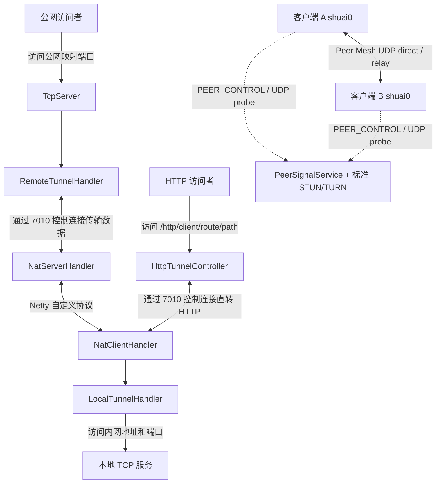

<p align="center">
  
</p>

# shuai-tunnel

`shuai-tunnel` 是一个以内网服务接入和私有组网为核心的多语言项目。Java 版本是当前基准实现；Go、C#、C 版本按同一协议对齐。它在公网服务端和内网客户端之间维护控制连接，并在收到映射配置后，将公网 TCP/HTTP 流量转发到客户端可访问的本地服务；Peer Mesh 让同一用户下的多个客户端通过虚拟 IP 互访，数据面优先走 UDP direct，失败时回退到服务端标准 TURN relay。

> 当前 README 按 Java 基准实现维护；其它语言实现的覆盖范围见[当前状态](#当前状态)。

## 工作原理



核心流程：

1. `tunnel-server` 启动 Spring Boot 应用，并在 `7010` 端口监听客户端控制连接。
2. `tunnel-client` 读取工作目录下的 `client.jsonc`（JSONC），先通过 HTTP `apiKey/secret` 登录，获取运行时 `clientName`、`accessToken`、控制连接地址和初始配置。
3. 客户端建立 Netty 控制连接并发送 `LOGIN_REQUEST`，服务端校验 token 后绑定在线会话。
4. 服务端向客户端发送 `NAT_CONTROL` 消息后，客户端动态添加 `NatClientHandler` 并注册端口映射。
5. 服务端为每个公网映射端口创建一个 `TcpServer`。
6. 公网请求到达映射端口后，数据经控制连接转发至客户端，再由客户端连接目标内网服务。
7. 开启 Peer Mesh 时，服务端通过 `PEER_CONTROL` 做设备列表、候选地址和 session 授权，客户端之间的数据面走加密 UDP direct，失败时回退到标准 TURN relay。

## 模块结构

| 模块 | 说明 |
| --- | --- |
| `implementations/java/common` | Java 公共协议、编解码器、登录鉴权、心跳、会话、消息和同步 HTTP 请求能力，Maven artifact 为 `tunnel-common` |
| `implementations/java/server` | 公网服务端（Java 参考实现），监听控制连接，并为已注册映射创建公网 TCP 监听端口，Maven artifact 为 `tunnel-server` |
| `implementations/java/client` | Java 内网客户端，连接服务端，并将隧道数据转发至目标内网服务，Maven artifact 为 `tunnel-client` |
| `apps/admin-web` | 管理后台前端(React + HeroUI)，构建产物供各服务端静态托管 |
| `deploy/java-server` | Java server 的 systemd 安装、更新脚本和环境变量模板 |
| `protocol/spec` | 跨语言协议说明、数据面/控制面规范入口 |
| `implementations/go/server` | Go 服务端移植，与 Java 服务端线协议字节兼容，支持多库(sqlite/pg/mysql) |
| `implementations/go/client` | Go 内网客户端，与 Java 客户端使用相同配置和紧凑二进制协议 |
| `implementations/csharp/protocol` | .NET 协议库，server/client 共同 ProjectReference 复用 |
| `implementations/csharp/server` | .NET 服务端移植(EF Core,多库) |
| `implementations/csharp/client` | .NET 内网客户端（CLI + Windows WPF 桌面客户端），与 Java/Go 客户端字节兼容 |
| `implementations/android/client` | Android 图形客户端，提供运行控制台、JSONC 配置、前台服务、TCP/HTTP 隧道、VpnService 和 Peer Mesh 基础数据面 |
| `implementations/c/server` | C 服务端轻量移植 |

主要入口：

- 服务端(Java)：`implementations/java/server/src/main/java/com/theshuai/tunnelserver/TunnelServerApplication.java`
- 服务端(Go)：`implementations/go/server/cmd/shuai-tunnel-server/main.go`
- 客户端(Java)：`implementations/java/client/src/main/java/com/theshuai/tunnelclient/TunnelClientApplication.java`
- 客户端(Go)：`implementations/go/client/cmd/shuai-tunnel-client/main.go`
- 客户端(.NET CLI)：`implementations/csharp/client/src/ShuaiTunnel.Client/Program.cs`
- 客户端(.NET 桌面)：`implementations/csharp/client/src/ShuaiTunnel.Client.Desktop/MainWindow.xaml`
- 客户端(Android)：`implementations/android/client/app/src/main/java/com/theshuai/tunnel/android/MainActivity.java`
- 管理后台前端：`apps/admin-web/`(`npm run dev` / `npm run deploy:java|go|csharp`)
- 协议实现：`implementations/java/common/src/main/java/com/theshuai/common/protocol/PacketCodec.java`

## 环境要求

- JDK 21
- Maven 3.x
- Node.js / npm（构建服务端管理后台静态资源时需要）
- Go 1.26（仅构建 Go 实现时需要）
- .NET 10 SDK（仅构建 .NET 实现时需要；Windows 桌面客户端目标框架为 `net10.0-windows`）

根目录 `pom.xml` 将 Java 编译版本设置为 `21`。仓库中的 Maven Wrapper 脚本没有可执行权限，且未提交 `.mvn` 目录，因此建议使用本机安装的 Maven。

## 构建

在项目根目录执行：

```bash
mvn clean install
```

`tunnel-server` 的 Maven 构建会在 `generate-resources` 阶段执行 `apps/admin-web` 的 `npm run deploy:java`：先构建 React 管理后台，再把 `dist/` 只同步到 Java server 的 `src/main/resources/static/`。首次构建前请在 `apps/admin-web` 下执行一次 `npm ci` 安装依赖。
`apps/admin-web/dist/` 和各 server 的静态同步目录都是构建产物,已在 `.gitignore` 中忽略,不要提交到仓库。

如只想构建后端、跳过前端打包与产物同步：

```bash
mvn clean install "-Dtunnel.server.web.skip=true"
```

Go / C# server 构建各自处理自己的前端产物：C# 项目构建时执行 `npm run deploy:csharp`；Go server 使用 `go generate ./web` 执行 `npm run deploy:go` 后再 `go build`，这样不会改动其它 server 的静态目录。

.NET 实现统一使用 `net10.0`；CLI 客户端、服务端和 Windows 桌面客户端可在对应 `implementations/csharp/*` 目录下用 `dotnet build` / `dotnet run` 构建运行。

## 启动

### 1. 启动服务端

```bash
cd implementations/java/server
mvn org.springframework.boot:spring-boot-maven-plugin:run
```

服务端会监听两个端口：

| 端口 | 用途 |
| --- | --- |
| `7010` | Netty 控制连接端口，默认值定义在 `application.yml` 中，可通过 `TUNNEL_NETTY_PORT` 覆盖 |
| `8088` | Spring Boot Web 和管理后台端口，定义在 `application.yml` 中 |

启动后访问 [http://127.0.0.1:8088](http://127.0.0.1:8088) 可进入管理后台。管理后台支持用户名/密码与 OIDC 登录，管理 API 校验 Bearer JWT，详见[管理后台登录](#管理后台登录)。

服务端默认使用当前工作目录下的 SQLite 数据库 `shuai-tunnel.db`。业务持久化层使用 Spring Data JPA 和 Hibernate；初始化阶段会用少量 `JdbcTemplate` 做旧库字段回填。首次启动时 Hibernate 会自动维护表结构，并创建演示客户端 `Demo client` 与启动凭证 `apiKey=demo-client / secret=test1234`（可通过 `TUNNEL_DB_SEED_DEMO_CLIENT=false` 关闭种子数据）。管理后台提供幂等的初始化按钮，用于补齐种子数据，不会清空已有数据。

如需在端口映射日志中显示服务端公网地址，可设置 `TUNNEL_PUBLIC_ADDRESS`。未设置时客户端会回退显示控制连接配置中的 `remoteAddress`。

### 多租户

Java `tunnel-server` 的管理面已经按租户隔离。客户端账号、TCP 映射、HTTP 路由、连接记录、连接归档和流量统计都会绑定 `tenant_id`；本地密码登录签发的 JWT 会写入 `tenant_id` claim，默认来自 `TUNNEL_AUTH_TENANT_ID=default`。OIDC 登录可通过 `TUNNEL_OIDC_TENANT_CLAIM` 指定租户 claim，默认读取 `tenant_id`；缺失时回退到默认租户。Go server 与 .NET server 已同步管理用户表、`/api/admin/me`、`/api/admin/users`、本地 JWT 的 `tenant_id` / `role` claims，以及客户端、凭证、映射、连接、流量列表的 owner 可见性过滤。

旧库升级时，启动初始化会把历史数据的空 `tenant_id` 回填为默认租户。需要注意的是，公网 TCP `listen_port` 仍是整台 server 的全局资源，不能被不同租户重复绑定。

### 2. 配置并启动客户端

客户端从当前工作目录读取 `client.jsonc`。该文件使用 JSONC 语法，支持 `//` / `/* */` 注释和尾逗号。在 `implementations/java/client` 目录中创建或修改该文件：

```jsonc
{
  "$schema": "https://tunnel.devshuai.com/schemas/client-startup-config.schema.json",
  // 服务端管理 HTTP 地址
  "serverBaseUrl": "http://127.0.0.1:8088",
  "apiKey": "demo-client",
  "secret": "test1234",
  "peerMeshDevice": "noop",
  "peerMeshTunName": "shuai0",
  "peerMeshMtu": 1280
}
```

字段说明：

| 字段 | 说明 |
| --- | --- |
| `serverBaseUrl` | 服务端管理 HTTP 地址，客户端会调用 `/api/client/auth/login` 获取运行时连接信息 |
| `apiKey` | 管理后台创建的客户端启动凭证 key |
| `secret` | 管理后台创建凭证时显示一次的密钥，用于签名启动登录请求 |
| `peerMeshDevice` | Peer Mesh 虚拟网卡模式，默认 `noop`；可选 `linux-tun`、`windows-wintun`、`wintun`、`mac-utun`、`utun`、`auto` |
| `peerMeshTunName` | Peer Mesh 虚拟网卡名称，默认 `shuai0` |
| `peerMeshMtu` | Peer Mesh 虚拟网卡 MTU，默认 `1280`；大于 `1280` 会被客户端归一化，避免 UDP 封装后公网路径分片丢包 |

> 完整示例见 `implementations/java/client/client.example.jsonc`、`implementations/go/client/client.example.jsonc` 和 `implementations/csharp/client/src/ShuaiTunnel.Client/client.example.jsonc`。

启动客户端：

```bash
cd implementations/java/client
mvn org.springframework.boot:spring-boot-maven-plugin:run
```

Java 客户端使用 `WebApplicationType.NONE`，不启动 Spring Web，也不监听 HTTP 端口；同机运行服务端和客户端时不再需要为客户端覆盖 `server.port`。

Go / .NET CLI 客户端使用同一份配置结构。

Android 客户端位于 `implementations/android/client`，提供运行控制台、配置摘要、JSONC 编辑器、启动/停止按钮和运行事件流；保存的配置兼容 `client.jsonc`，内置 `VpnService` 权限流程。开启 Peer Mesh 时，Android 会创建系统 VPN 接口，并接入 direct UDP、STUN server-reflexive candidate、TURN relay、session 刷新、direct-stale fallback 以及基础链路/流量/设备上报；端口预测和完整真机矩阵仍以 Java/Go/.NET 客户端为准。

Go 客户端：

```bash
cd implementations/go/client
go run ./cmd/shuai-tunnel-client
```

.NET CLI 客户端：

```bash
cd implementations/csharp/client
dotnet run --project src/ShuaiTunnel.Client -- --config client.jsonc
```

Windows 桌面客户端提供图形化连接入口，不需要手写 `client.jsonc`：在界面填写 `serverBaseUrl`、`apiKey`、`secret`、Peer Mesh 虚拟网卡模式、网卡名和 MTU 后点击连接。它会保存配置到 `%APPDATA%\ShuaiTunnel\desktop-client.json`，并展示当前客户端名、控制端地址、TCP 路由、HTTP 路由、Peer Mesh 对端、活跃 session 和运行日志。主题支持跟随系统、浅色和深色。

```powershell
cd implementations/csharp/client
dotnet run --project src/ShuaiTunnel.Client.Desktop

# 发布 win-x64 单文件桌面包
powershell -ExecutionPolicy Bypass -File scripts\publish-desktop-win-x64.ps1
.\out\desktop-win-x64\shuai-tunnel-desktop.exe
```

如果桌面客户端用 `windows-wintun` 或 `auto` 创建 Peer Mesh 虚拟网卡，需要管理员权限；发布产物会带上 `native/windows/<arch>/wintun.dll`，也可以通过 `SHUAI_PEER_MESH_WINTUN_DLL` 覆盖 Wintun DLL 路径。

### 3. 下发端口映射

端口映射在管理后台维护，并通过 `NAT_CONTROL` 消息下发给在线客户端。客户端收到后会向服务端注册映射，服务端随即在对应公网端口上开始监听。

在管理后台的「端口映射（NAT）」面板中：

1. 选择目标客户端，填写公网端口、内网目标地址和内网端口，新增一条映射。
2. 在线客户端会立即收到完整映射快照；离线客户端会在下次登录时自动收到并注册已启用的映射。

Java/Go/C# 客户端登录成功后收到服务端返回的初始映射快照，并在后续收到 `NAT_CONTROL` 消息时同步注册端口映射。后台新增或删除映射时会向在线客户端自动同步完整映射快照。

也可以直接调用管理 API（`/api/admin/**` 需携带 Bearer JWT，详见[管理后台登录](#管理后台登录)）。先换取一个令牌：

```bash
# 用户名/密码登录换取 HS256 JWT（默认 admin / admin，请务必修改）
TOKEN=$(curl -s -X POST http://127.0.0.1:8088/auth/login \
  -H 'Content-Type: application/json' \
  -d '{"username":"admin","password":"admin"}' | jq -r .accessToken)
```

```bash
# 为客户端 ID=123 新增映射：公网 9000 -> 内网 127.0.0.1:8080
curl -H "Authorization: Bearer $TOKEN" -X POST http://127.0.0.1:8088/api/admin/clients/123/tunnels \
  -H 'Content-Type: application/json' \
  -d '{"listenPort":9000,"targetAddress":"127.0.0.1","targetPort":8080}'

# 立即向在线客户端下发该客户端启用的全部映射
curl -H "Authorization: Bearer $TOKEN" -X POST http://127.0.0.1:8088/api/admin/clients/123/nat-control
```

上面的示例表示：访问服务端 `9000` 端口的 TCP 流量，将被转发到客户端网络中的 `127.0.0.1:8080`。客户端离线时手动下发接口返回 `409`。

## 协议概览

完整跨语言协议说明见 [protocol/spec](protocol/spec/README.md)。根 README 只保留主流程摘要：

| 文档 | 内容 |
| --- | --- |
| [control-protocol.md](protocol/spec/control-protocol.md) | 控制连接帧、`Command`、`MessageType`、`NAT_CONTROL` 和 `NAT_MESSAGE` |
| [client-auth.md](protocol/spec/client-auth.md) | 客户端 HTTP 登录、apiKey/secret 签名、运行时 token 和刷新 |
| [http-route.md](protocol/spec/http-route.md) | HTTP route、WebSocket 隧道、Header 规则、路径改写和观测字段 |
| [peer-mesh.md](protocol/spec/peer-mesh.md) | 私有组网、虚拟 IP、标准 STUN/TURN、加密数据帧和管理面 |
| [public-transfer.md](protocol/spec/public-transfer.md) | 公共发现信令、ICE 配置、附件直传、对象存储和限流 |
| [client-messages.md](protocol/spec/client-messages.md) | 管理端与客户端文本消息、鉴权、能力声明和 fallback |

控制连接使用自定义二进制协议：

| 字段 | 长度 | 说明 |
| --- | --- | --- |
| `magic` | 4 字节 | 固定值 `0x14353565` |
| `version` | 1 字节 | 协议版本 |
| `serializer` | 1 字节 | 序列化算法 |
| `command` | 1 字节 | 消息指令 |
| `length` | 4 字节 | 消息体长度 |
| `body` | N 字节 | 消息体 |

协议分三层：帧头 `Command` 定义登录、退出、心跳、普通消息、同步 HTTP、`DIRECT_HTTP_*` 与单一 `NAT_MESSAGE`；普通消息的 `MessageType` 当前包含 `SERVER_TO_CLIENT`、`CLIENT_TO_SERVER`、`CLIENT_TO_CLIENT`、`NAT_CONTROL` 和 `PEER_CONTROL`；`NAT_MESSAGE` 再由 `NatMessageType` 区分注册、注册结果、连接建立、断开、数据转发、保活、解除注册和兼容保留的 `HTTP_ROUTES_REPORT`（当前 Java server 忽略）。其中同步 HTTP 指令保留在线协议中，当前公网 HTTP 主路径使用 `DIRECT_HTTP_*`。

序列化默认使用紧凑二进制（`CompactBinarySerializer`）：省略字段名，使用变长整数与短类型标记，并在消息体 ≥ 阈值且压缩后更小时启用 Deflate（带 1 字节 payload 类型标记，解压有 `16 MiB` 上限）。默认 `TUNNEL_NETTY_MAX_FRAME_SIZE=33554432` 按完整帧计算，包含 11 字节 header，因此最大 body 为 `33554421` 字节。普通控制消息按此编码；**NAT 消息例外**——其元数据（`NatMessagePacket`）因采用自定义布局仍固定使用 JSON 序列化，仅其中的隧道字节流载荷套用紧凑二进制的 payload 编码（同样可触发 Deflate）。由于默认序列化算法和 NAT 数据封装已经变更，服务端和客户端需要同步升级。

## 管理后台

内置管理后台支持：

- 查看、编辑、停用和删除客户端
- 创建和管理客户端启动凭证（apiKey/secret），并限制同一凭证的在线实例数
- 维护每个客户端的 TCP 端口映射，并向在线客户端下发 `NAT_CONTROL` 配置
- 管理私有组网设备、虚拟 IP、在线状态、NAT 探测结果、链路、活跃会话和 ACL，并支持清理会话
- 查看控制连接成功和失败记录
- 按客户端和 UTC 日期汇总上下行流量，并查看 HTTP 请求/响应详情与 TCP payload 记录
- HTTP 记录支持按常用字段、方法、状态码、路径、Header、Body 等字段分页搜索；Header 可在表单/Raw 间切换，并内置常见 Header 说明与规范链接
- HTTP Body 支持 JSON 高亮、表单、HTML、XML、图片和文本预览；遇到 `Content-Encoding: gzip` / `deflate` / `br` 的新记录会在服务端解压后保存，旧记录展示时会做浏览器侧兜底解压或给出不可还原提示
- 配置每个客户端每分钟允许的控制连接次数（新建客户端默认 `30`）；设置为 `0` 表示不限
- 手动执行幂等数据库初始化

客户端启动凭证的 secret 在数据库中以 SHA-256 摘要（十六进制）保存；客户端启动时使用该摘要派生 HMAC-SHA256 签名密钥。secret 明文只在创建或重置凭证时显示一次。

## 管理后台登录

管理页面支持两种登录方式，**用户名/密码**与 **OIDC** 可同时启用；管理 API（`/api/admin/**`）统一校验 Bearer JWT（Spring Security OAuth2 Resource Server）。两类令牌按 JWT 头部的 `alg` 路由：本地密码登录签发 HS256（用本地密钥校验），OIDC 网关签发 RS256（按 JWKS 验签）。原先的 Basic Auth 已移除。

### 用户名/密码登录

页面提交用户名和密码到 `POST /auth/login`，校验通过后服务端用 HS256 密钥签发一个短期 JWT，页面像 OIDC 令牌一样作为 `Authorization: Bearer` 使用。默认 `admin / admin`，**暴露前务必修改**；把密码设为空即可关闭该登录方式。

| 环境变量 | 默认 | 说明 |
| --- | --- | --- |
| `TUNNEL_AUTH_USERNAME` | `admin` | 管理用户名 |
| `TUNNEL_AUTH_PASSWORD` | `admin` | 管理密码；留空则禁用密码登录 |
| `TUNNEL_AUTH_TENANT_ID` | `default` | 本地密码登录和内置 admin 使用的默认租户 |
| `TUNNEL_AUTH_PASSWORD_LOGIN_ENABLED` | `true` | 是否启用密码登录 |
| `TUNNEL_AUTH_JWT_SECRET` | （空） | HS256 签名密钥；留空则启动时随机生成（重启后旧令牌失效，需重新登录） |
| `TUNNEL_AUTH_TOKEN_TTL_SECONDS` | `28800` | 密码登录令牌有效期（秒），默认 8 小时 |

### OIDC 登录（授权码 + PKCE）

1. 浏览器从 `GET /oidc-config` 读取登录参数，跳转到网关的授权端点（带 `code_challenge`）。
2. 授权完成后带 `code` 回到管理页；页面把 `code` 发给同源的 `POST /oidc/token`，由服务端代理换取令牌（避免浏览器直接调用网关令牌端点的 CORS 问题，也让可选的 client-secret 留在服务端）。
3. 页面用拿到的 access token 作为 `Authorization: Bearer` 调用管理 API；返回 `401` 时回到登录页。

默认配置指向项目网关 `https://gateway.toys.theshuai.com/auth`，发现到的端点已写入默认值。**每个部署必须设置 `TUNNEL_OIDC_CLIENT_ID`，并在网关为该客户端注册回调地址 `TUNNEL_OIDC_REDIRECT_URI`（默认 `http://127.0.0.1:8088/`）。** 公共 PKCE 客户端无需 secret；若是机密客户端，再设置 `TUNNEL_OIDC_CLIENT_SECRET`。

| 环境变量 | 默认 | 说明 |
| --- | --- | --- |
| `TUNNEL_OIDC_CLIENT_ID` | （空） | OIDC 客户端 ID，**必填**；未设置时登录页会提示未配置 |
| `TUNNEL_OIDC_REDIRECT_URI` | `http://127.0.0.1:8088/` | 回调地址，需与网关注册的一致，并指向管理页地址 |
| `TUNNEL_OIDC_CLIENT_SECRET` | （空） | 机密客户端的密钥；公共 PKCE 客户端留空 |
| `TUNNEL_OIDC_SCOPE` | `openid` | 授权请求的 scope |
| `TUNNEL_OIDC_AUDIENCE` | （空） | 设置后额外校验 JWT 的 audience |
| `TUNNEL_OIDC_ISSUER` / `TUNNEL_OIDC_JWK_SET_URI` | 指向网关 | JWT 验签与 issuer 校验；JWKS 在首次校验令牌时按需拉取，不在启动时联网 |
| `TUNNEL_OIDC_AUTHORIZATION_ENDPOINT` / `TUNNEL_OIDC_TOKEN_ENDPOINT` / `TUNNEL_OIDC_END_SESSION_ENDPOINT` | 指向网关 | 授权 / 令牌 / 登出端点 |
| `TUNNEL_OIDC_TENANT_CLAIM` | `tenant_id` | 从 OIDC JWT 读取租户的 claim 名称；缺失时回退默认租户 |

> OIDC 令牌会先完成签名、issuer 和可选 audience 校验；Java、Go 和 .NET server 均可通过 `TUNNEL_OIDC_TENANT_CLAIM` 解析 OIDC 租户，claim 缺失时回退默认租户。本地密码登录令牌包含明确的 `tenant_id` / `role`。

## HTTP 直转通道

HTTP 直转通道与 TCP 端口映射并行工作。服务端收到请求后，通过客户端控制连接转发 HTTP 方法、路径、查询参数、请求头和二进制请求体；客户端请求本地配置的目标服务，再将状态码、响应头和二进制响应体返回。

客户端配置中的 `route` 决定可访问的内网目标。例如：

```json
{
  "httpTunnelConfigList": [
    {
      "route": "web",
      "targetBaseUrl": "http://127.0.0.1:8080"
    }
  ]
}
```

客户端登录后，可通过服务端直接访问：

```bash
curl -i http://127.0.0.1:8088/http/Demo%20client/web/api/hello?source=tunnel
```

该请求会转发到客户端网络中的 `http://127.0.0.1:8080/api/hello?source=tunnel`。`/http/**` 默认作为公开流量入口，不需要管理令牌；只有客户端配置过的 route 可以被访问。单次请求体默认限制为 `16 MiB`，可通过 `TUNNEL_HTTP_MAX_REQUEST_BODY_SIZE` 调整。转发超时默认是 `30000` 毫秒，可通过 `TUNNEL_HTTP_TIMEOUT_MS` 调整。HTTP 路由开启路径改写时，单次可改写响应体默认上限是 `10 MiB`，可通过 `TUNNEL_HTTP_REWRITE_MAX_BODY_BYTES` 调整。

## 私有组网（Peer Mesh）

Peer Mesh 默认关闭。开启后，同一租户和同一用户下的客户端会被分配 `100.96.0.0/11` 内的虚拟 IP，并通过 `shuai0` 这类虚拟网卡互访。控制面仍走现有 Netty 连接，服务端通过 `PEER_CONTROL` 下发设备列表、候选地址、session 授权和启停状态；数据面优先走客户端之间的加密 UDP direct，direct 失效或不可达时回退到服务端标准 TURN relay。服务端 relay 只校验会话授权和 frame 头，不解密业务 IP 包明文。

当前实现同时使用自建 STUN/TURN 和可配置公共 STUN。客户端登录后会拿到 `stunHost/stunPort`、`turnHost/turnPort`、公共 STUN 列表和 ICE 凭证；自建 STUN/TURN 负责 NAT 探测、候选交换和 relay，公共 STUN 只用于补充 server-reflexive 候选地址，不提供 relay。客户端会保存多个公网映射观测值，按端口变化做自适应预测，并在 direct path 过期后主动触发重新探测和 relay fallback。

服务端相关配置：

| 配置 | 环境变量 | 默认 | 说明 |
| --- | --- | --- | --- |
| `tunnel.peer-mesh.enabled` | `TUNNEL_PEER_MESH_ENABLED` | `false` | 是否启用 Peer Mesh |
| `tunnel.peer-mesh.cidr` | `TUNNEL_PEER_MESH_CIDR` | `100.96.0.0/11` | 虚拟网段 |
| `tunnel.peer-mesh.public-address` | `TUNNEL_PEER_MESH_PUBLIC_ADDRESS` | （空） | 对客户端公布的 STUN/TURN 地址；为空时回退登录请求域名 |
| `tunnel.peer-mesh.stun-turn-port` | `TUNNEL_PEER_MESH_STUN_TURN_PORT` | `3478` | 标准 STUN/TURN UDP 主端口 |
| `tunnel.peer-mesh.nat-probe-alternate-port` | `TUNNEL_PEER_MESH_NAT_PROBE_ALTERNATE_PORT` | `3479` | NAT 探测备用 UDP 端口，用于更准确地区分端口映射行为 |
| `tunnel.peer-mesh.public-stun-servers` | `TUNNEL_PEER_MESH_PUBLIC_STUN_SERVERS` | （空） | 额外公共 STUN 服务器，多个地址用英文逗号分隔，支持 `host:port` / `stun:host:port` |
| `tunnel.peer-mesh.session-ttl-seconds` | `TUNNEL_PEER_MESH_SESSION_TTL_SECONDS` | `3600` | peer session 授权有效期 |
| `tunnel.peer-mesh.allocation-ttl-seconds` | `TUNNEL_PEER_MESH_ALLOCATION_TTL_SECONDS` | `300` | relay allocation TTL |
| `tunnel.peer-mesh.relay-min-port` | `TUNNEL_PEER_MESH_RELAY_MIN_PORT` | `49152` | TURN relay 分配端口范围下限 |
| `tunnel.peer-mesh.relay-max-port` | `TUNNEL_PEER_MESH_RELAY_MAX_PORT` | `65535` | TURN relay 分配端口范围上限 |
| `tunnel.peer-mesh.relay-worker-threads` | `TUNNEL_PEER_MESH_RELAY_WORKER_THREADS` | `0` | relay 数据帧工作线程数，`0` 表示按 CPU 自动选择 |
| `tunnel.peer-mesh.relay-worker-queue-capacity` | `TUNNEL_PEER_MESH_RELAY_WORKER_QUEUE_CAPACITY` | `10000` | relay 工作队列上限，队列满时丢弃新的 relay 数据帧以保护服务端 |
| `tunnel.peer-mesh.relay-traffic-flush-interval-ms` | `TUNNEL_PEER_MESH_RELAY_TRAFFIC_FLUSH_INTERVAL_MS` | `5000` | relay 流量聚合入库间隔 |
| `tunnel.peer-mesh.turn-auth-required` | `TUNNEL_PEER_MESH_TURN_AUTH_REQUIRED` | `true` | 是否要求 Allocate/Refresh/CreatePermission 携带长期凭证认证 |
| `tunnel.peer-mesh.turn-realm` | `TUNNEL_PEER_MESH_TURN_REALM` | `shuai-tunnel` | TURN realm；参与 MESSAGE-INTEGRITY key 派生 |
| `tunnel.peer-mesh.turn-shared-secret` | `TUNNEL_PEER_MESH_TURN_SHARED_SECRET` | （空） | 临时 credential HMAC-SHA1 密钥；为空时使用进程内随机密钥，重启后旧凭证失效 |
| `tunnel.peer-mesh.turn-credential-ttl-seconds` | `TUNNEL_PEER_MESH_TURN_CREDENTIAL_TTL_SECONDS` | `3600` | 临时 TURN credential 有效期，最小 60 秒 |

公网安全组 / 防火墙需要放行 `3478/udp`、`3479/udp` 和 relay 分配端口范围（默认 `49152-65535/udp`）。如果不希望开放完整高端口范围，可以把 `relay-min-port` / `relay-max-port` 收窄到可控区间，并同步开放该区间。

客户端侧 `peerMeshDevice` 决定虚拟网卡实现：`linux-tun` 使用 `/dev/net/tun`，需要 root 或 `CAP_NET_ADMIN`；`windows-wintun` / `wintun` 使用随客户端分发的 Wintun 动态库；Java / Go / .NET 客户端均支持 `utun` 接入 macOS utun，其中 Java 可使用 `mac-utun` / `utun`，`auto` 会按系统选择；`noop` 只保留控制面，不创建虚拟网卡。更完整的信令、加密帧和 NAT 探测说明见 [protocol/spec/peer-mesh.md](protocol/spec/peer-mesh.md)。

管理后台的「私有组网」页面展示设备虚拟 IP、在线状态、虚拟网卡状态、NAT 类型、候选 Endpoint、链路和活跃会话，并支持启停设备、配置 ACL、分页查看会话、清理活跃会话和链路。公开的浏览器 NAT 检测页会调用 `/api/public/peer-mesh/stun-config` 获取自建 STUN，再结合配置的公共 STUN 进行 WebRTC 探测。

## 公共互传与对象存储

公共发现信令使用 `/ws/public-transfer/discovery`；附件由服务端签发短期 URL，浏览器直接 PUT/GET 私有 Aliyun OSS，业务服务只保存元数据；存储启用时 complete 用 HEAD 校验实际大小。对象存储默认关闭，新 presign 在通过来源 IP/房间配额检查后返回 `409`，不会返回占位 URL；运行中关闭存储后，已有 `PENDING` 记录的 complete 会按 Java 语义跳过 HEAD。完整 payload、隔离和错误语义见 [public-transfer.md](protocol/spec/public-transfer.md)。

| 配置 | 环境变量 | 默认 | 说明 |
| --- | --- | --- | --- |
| `tunnel.object-storage.provider` | `TUNNEL_OBJECT_STORAGE_PROVIDER` | `disabled` | `disabled` 或 `aliyun-oss` |
| `tunnel.object-storage.endpoint` / `.bucket` | `TUNNEL_OBJECT_STORAGE_ENDPOINT` / `TUNNEL_OBJECT_STORAGE_BUCKET` | （空） | OSS endpoint 与私有 bucket |
| `tunnel.object-storage.access-key-id` / `.access-key-secret` | `TUNNEL_OBJECT_STORAGE_ACCESS_KEY_ID` / `TUNNEL_OBJECT_STORAGE_ACCESS_KEY_SECRET` | （空） | OSS 访问凭证 |
| `tunnel.object-storage.object-prefix` | `TUNNEL_OBJECT_STORAGE_PREFIX` | `shuai-tunnel/attachments` | object key 前缀 |
| `tunnel.object-storage.upload-url-ttl-seconds` | `TUNNEL_OBJECT_STORAGE_UPLOAD_URL_TTL_SECONDS` | `900` | 上传预签名 URL TTL |
| `tunnel.object-storage.download-url-ttl-seconds` | `TUNNEL_OBJECT_STORAGE_DOWNLOAD_URL_TTL_SECONDS` | `600` | 下载预签名 URL TTL |
| `tunnel.object-storage.retention-hours` | `TUNNEL_OBJECT_STORAGE_RETENTION_HOURS` | `72` | 附件保留小时数；实现最小按 1 小时处理 |
| `tunnel.object-storage.max-attachment-bytes` | `TUNNEL_OBJECT_STORAGE_MAX_ATTACHMENT_BYTES` | `536870912` | 声明与 HEAD 实际大小上限 |
| `tunnel.object-storage.expiration-scan-interval-ms` | `TUNNEL_OBJECT_STORAGE_EXPIRATION_SCAN_INTERVAL_MS` | `3600000` | 过期扫描间隔 |
| `tunnel.public-transfer.presign-rate-limit-per-ip` | `TUNNEL_PUBLIC_TRANSFER_PRESIGN_RATE_LIMIT_PER_IP` | `30` | 单来源 IP 每窗口公开 presign-upload 次数 |
| `tunnel.public-transfer.presign-rate-limit-window-seconds` | `TUNNEL_PUBLIC_TRANSFER_PRESIGN_RATE_LIMIT_WINDOW_SECONDS` | `300` | presign 固定窗口秒数 |
| `tunnel.public-transfer.max-pending-uploads-per-room` | `TUNNEL_PUBLIC_TRANSFER_MAX_PENDING_UPLOADS_PER_ROOM` | `50` | 同 roomToken 哈希下 PENDING 上限 |
| `tunnel.public-transfer.max-discovery-peers-per-room` | `TUNNEL_PUBLIC_TRANSFER_MAX_DISCOVERY_PEERS_PER_ROOM` | `32` | 单发现房间在线 peer 上限 |
| `tunnel.public-transfer.discovery-message-rate-limit-per-connection` | `TUNNEL_PUBLIC_TRANSFER_DISCOVERY_MESSAGE_RATE_LIMIT_PER_CONNECTION` | `120` | 单发现连接每窗口消息数 |
| `tunnel.public-transfer.discovery-message-rate-limit-window-seconds` | `TUNNEL_PUBLIC_TRANSFER_DISCOVERY_MESSAGE_RATE_LIMIT_WINDOW_SECONDS` | `60` | 发现消息限流窗口秒数 |

## 控制连接 TLS

服务端控制连接默认为明文 TCP（`TUNNEL_TLS_MODE=disabled`，向后兼容）。需要加密时，服务端通过 `tunnel.tls.mode` 选择启用方式，客户端在控制连接上叠加一层 TLS：

| `TUNNEL_TLS_MODE` | 说明 |
| --- | --- |
| `disabled` | 默认。控制连接为明文 TCP，与旧部署兼容 |
| `file` | 生产环境。从磁盘加载真实的 keystore（JKS / PKCS12）签发服务端证书 |
| `self-signed` | 仅开发/测试。启动时生成一次性自签名证书，控制连接已加密但不校验 CA |

服务端：

```bash
# 生产：使用磁盘上的 keystore
TUNNEL_TLS_MODE=file \
TUNNEL_TLS_KEYSTORE=/path/to/server.p12 \
TUNNEL_TLS_KEYSTORE_PASSWORD=changeit \
TUNNEL_TLS_KEY_PASSWORD=changeit \
mvn org.springframework.boot:spring-boot-maven-plugin:run

# 开发/测试：一次性自签名证书
TUNNEL_TLS_MODE=self-signed \
mvn org.springframework.boot:spring-boot-maven-plugin:run
```

> 服务端开启 TLS 后，**客户端必须同步开启 TLS**，否则握手失败。当前 Java 客户端入口（`TunnelClientApplication`）默认按明文连接；如需启用 TLS，请使用 `NettyClient.buildClientSslContext(truststorePath, truststorePassword)` 构造信任服务端证书的 `SslContext`，并以 `new NettyClient(tunnelBean, sslContext)` 启动；与自签名服务端联调时可用 `NettyClient.buildInsecureClientSslContext()`（仅限测试）。Go 客户端同样需要在控制连接上启用 TLS。

| 环境变量 | 默认 | 说明 |
| --- | --- | --- |
| `TUNNEL_TLS_MODE` | `disabled` | TLS 模式：`disabled` / `file` / `self-signed` |
| `TUNNEL_TLS_KEYSTORE` | （空） | 服务端 keystore 路径，仅 `mode=file` 时使用 |
| `TUNNEL_TLS_KEYSTORE_PASSWORD` | （空） | keystore 密码 |
| `TUNNEL_TLS_KEY_PASSWORD` | （空） | key 密码，留空时回退到 keystore 密码 |

## 数据库切换

默认配置使用 SQLite：

```bash
TUNNEL_DB_URL=jdbc:sqlite:./shuai-tunnel.db \
TUNNEL_DB_DRIVER=org.sqlite.JDBC \
TUNNEL_DB_DIALECT=org.hibernate.community.dialect.SQLiteDialect \
mvn org.springframework.boot:spring-boot-maven-plugin:run
```

切换至 MySQL：

```bash
TUNNEL_DB_URL=jdbc:mysql://127.0.0.1:3306/shuai_tunnel \
TUNNEL_DB_DRIVER=com.mysql.cj.jdbc.Driver \
TUNNEL_DB_DIALECT=org.hibernate.dialect.MySQLDialect \
TUNNEL_DB_USERNAME=root \
TUNNEL_DB_PASSWORD=your-password \
TUNNEL_DB_POOL_SIZE=8 \
mvn org.springframework.boot:spring-boot-maven-plugin:run
```

切换至 PostgreSQL：

```bash
TUNNEL_DB_URL=jdbc:postgresql://127.0.0.1:5432/shuai_tunnel \
TUNNEL_DB_DRIVER=org.postgresql.Driver \
TUNNEL_DB_DIALECT=org.hibernate.dialect.PostgreSQLDialect \
TUNNEL_DB_USERNAME=postgres \
TUNNEL_DB_PASSWORD=your-password \
TUNNEL_DB_POOL_SIZE=8 \
mvn org.springframework.boot:spring-boot-maven-plugin:run
```

### 连接池、批量写入与连接记录归档

面向大量客户端的场景，服务端做了以下数据库工程化处理：

- **连接池**：HikariCP 连接池大小由 `TUNNEL_DB_POOL_SIZE` 控制。默认 `1` 适配单写者的 SQLite；切换到 MySQL/PostgreSQL 时应调大（建议 `16`–`32`）。
- **批量写入**：Hibernate 启用 `batch_size`（默认 `50`，由 `TUNNEL_DB_BATCH_SIZE` 调整），合并流量聚合的更新与归档时的批量删除。
- **登录链路**：鉴权、连接记录写入和 `NAT_CONTROL` 下发都在独立的有界线程池中执行，不占用 Netty I/O 事件循环（见 `tunnel.login.executor.*`）。
- **流量聚合**：上下行字节先在内存中按客户端累加，每 `TUNNEL_TRAFFIC_FLUSH_INTERVAL_MS` 毫秒按「客户端 + UTC 日期」批量 upsert 一行，而非每个数据包写库。
- **索引**：连接记录表对 `(client_id, connected_at)` 建复合索引（服务每次登录的频率限制查询），并对 `connected_at` 建索引（服务归档扫描）。
- **连接记录归档**：连接记录是逐次登录追加的日志，会无限增长。后台定时任务把**早于保留窗口的明细按自然月汇总成总量**（连接数 / 成功数 / 失败数，保存在 `tunnel_connection_stat` 表，长期保留），**汇总完成后**才删除原始明细——数据不会丢失。明细默认保留**最近 60 天（滚动窗口）**。跨越截止点的月份会随天数滚出窗口而逐步汇总，计数采用累加且在同一事务内删除已汇总明细，因此不会重复计数。归档后的月度总量可通过 `GET /api/admin/connection-stats?clientName=...` 查询。

| 配置 | 环境变量 | 默认 | 说明 |
| --- | --- | --- | --- |
| `tunnel.connection-record.detail-retention-days` | `TUNNEL_CONNECTION_DETAIL_RETENTION_DAYS` | `60` | 保留最近多少天的连接明细（滚动窗口）；更早的明细按自然月汇总后删除。`0` 关闭归档 |
| `tunnel.connection-record.archive-interval-ms` | `TUNNEL_CONNECTION_ARCHIVE_INTERVAL_MS` | `3600000` | 归档任务执行间隔（毫秒） |
| `spring.jpa.properties.hibernate.jdbc.batch_size` | `TUNNEL_DB_BATCH_SIZE` | `50` | Hibernate JDBC 批量大小 |

Go server 与 .NET server 也兼容 `TUNNEL_CONNECTION_DETAIL_RETENTION_DAYS` 和 `TUNNEL_CONNECTION_ARCHIVE_INTERVAL_MS`，用于对齐 Java 的连接明细归档策略。

> 月度归档总量（`tunnel_connection_stat`）与每日流量（`tunnel_traffic_usage`）都长期保留，只有连接明细会被汇总后清理。对于超大规模部署，建议进一步在数据库层对明细表按 `connected_at` 做时间分区（如 PostgreSQL 声明式分区）；JPA 的 `ddl-auto` 不会自动建立分区，需要在数据库侧维护。首次归档历史积压较大时，单次事务会汇总并删除全部过期明细，必要时可分批执行。

### 流量明细存储

Java 参考实现中，HTTP 协议记录和 TCP payload 记录默认写入业务数据库；配置 Elasticsearch 后会自动切换到 ES 存储，管理页查询同一套接口。明细采集由全局总开关和通道开关共同控制，全局总开关默认关闭，每条 HTTP 路由 / TCP 映射新建时也默认关闭明细采集，需要在管理页单独打开。写入时会保留完整 HTTP body 与 TCP 二进制 payload，压缩 HTTP Body 的解压预览有独立大小上限，页面按分页读取；HTTP 与 TCP 索引都可通过体积上限自动清理最旧记录。管理查询默认不强制 flush，避免读请求放大写入压力。

| 配置 | 环境变量 | 默认 | 说明 |
| --- | --- | --- | --- |
| `tunnel.elasticsearch.uris` | `TUNNEL_ELASTICSEARCH_URIS` | （空） | ES 地址，多个节点用逗号分隔；为空时继续使用数据库存储流量明细 |
| `tunnel.elasticsearch.username` | `TUNNEL_ELASTICSEARCH_USERNAME` | （空） | ES 用户名 |
| `tunnel.elasticsearch.password` | `TUNNEL_ELASTICSEARCH_PASSWORD` | （空） | ES 密码 |
| `tunnel.elasticsearch.api-key` | `TUNNEL_ELASTICSEARCH_API_KEY` | （空） | ES API Key；设置后优先于用户名密码 |
| `tunnel.elasticsearch.http-index` | `TUNNEL_ELASTICSEARCH_HTTP_INDEX` | `shuai-tunnel-http-traffic` | HTTP 流量索引 |
| `tunnel.elasticsearch.tcp-index` | `TUNNEL_ELASTICSEARCH_TCP_INDEX` | `shuai-tunnel-tcp-traffic` | TCP 流量索引 |
| `tunnel.elasticsearch.http-max-store-size` | `TUNNEL_ELASTICSEARCH_HTTP_MAX_STORE_SIZE` | `100GB` | HTTP 明细索引最大存储体积，超过后删除最旧记录 |
| `tunnel.elasticsearch.tcp-max-store-size` | `TUNNEL_ELASTICSEARCH_TCP_MAX_STORE_SIZE` | `10GB` | TCP payload 索引最大存储体积 |

HTTP 流量入库前会根据 `Content-Encoding` 对 `gzip`、`deflate`、`br` 响应体做解压，管理页再按 `Content-Type` 提供对应预览；如果历史记录只保存了已损坏的压缩文本，页面会提示缺少可还原的原始压缩字节。

Go server 和 .NET server 已补齐数据库版资源级流量聚合、HTTP/TCP 明细采集、分页查询、字段搜索和 TCP 串流查询，并已兼容 `gzip`、`deflate` 的 zlib / raw deflate 以及 `br` Brotli 响应预览解码；同时支持 Java 风格 Elasticsearch 可选存储与 HTTP 100GB / TCP 10GB 索引容量治理。

## 当前状态

已实现：

- 客户端启动登录（基于 apiKey/secret 的 **HMAC-SHA256** 签名，canonical message 只覆盖 apiKey、时间戳、nonce、`machineFingerprint` 与 `osUser`，并校验 60 秒时间窗）、运行时 token 控制通道登录、心跳保活；hostname、系统版本、公钥和能力声明不在签名内，nonce 当前也未持久化去重，因此时间窗内仍可能重放同一签名
- 基于 Spring Data JPA 和 Hibernate 的 SQLite、MySQL 和 PostgreSQL 持久化与初始化
- 客户端账号分配、连接记录、连接频率限制（默认每分钟 `30` 次，`0` 表示不限）和流量统计
- 内置管理 API 和管理页面，支持用户名/密码与 OIDC（授权码 + PKCE）两种登录，后端统一校验 Bearer JWT
- 多租户管理用户：内置 admin 来自配置，其它用户保存到数据库；admin 可管理用户和查看租户内全部资源，普通用户只能看到自己创建的客户端、凭证、映射、连接和流量
- 端口映射的持久化管理，以及通过 `NAT_CONTROL` 完成登录自动下发和在线快照同步
- 基于客户端 route 白名单的 HTTP 请求直接转发
- HTTP / TCP 流量明细观测，支持通道级采集开关（默认关闭）、分页搜索、Header 说明、HTTP Body 类型化预览、压缩响应解码，以及 DB / Elasticsearch 存储切换
- 控制连接断开后的指数退避重连
- TCP 公网端口监听和双向数据转发
- 服务端通过控制连接请求客户端发起 HTTP 请求，并同步等待响应
- Peer Mesh：虚拟 IP 分配、Linux TUN / Windows Wintun / macOS utun、同用户默认互通、`PEER_CONTROL` 信令、标准 STUN/TURN、公共 STUN 候选补充、UDP direct、server relay、NAT 类型探测、链路和会话展示
- 可选的控制连接 TLS（`file` 加载 keystore / `self-signed` 自签名）
- 免登录房间文件互传：默认关闭“接收前确认”，收到文件元数据后自动开始接收；仅在会话内开启该开关后才显示接收/拒绝，拒绝后发送端不会绕过拒绝回退 OSS
- 与 Java 协议兼容的 Go 客户端，支持登录、心跳、自动重连、TCP 映射和 HTTP 直转
- Go/.NET server 已同步 Java 管理用户与租户/owner 权限基础，并已对齐 TCP 映射 / HTTP 路由的通道级 `detailCaptureEnabled` 管理字段以及 HTTP 路由的 `pathRewriteEnabled` 配置和回包路径改写行为
- Go/.NET server 已补齐数据库版资源级流量聚合和 HTTP/TCP 明细观测，包括资源流量表、明细表、热路径采集写入、资源列表、HTTP 分页与字段搜索、TCP 分页、单帧详情和按 channel 串流查询；同时已支持 Java 风格 Elasticsearch 可选存储与 HTTP 100GB / TCP 10GB 索引容量治理
- Go/.NET server 已对齐 Java 公共互传与客户端消息主路径：`/ws/public-transfer/discovery`、6 个公共/管理附件接口、Aliyun OSS 预签名与 HEAD 完成校验、过期清理、来源 IP/房间限流、`/ws/client-messages`、消息能力持久化和 client/admin fallback；TURN 临时 credential、MESSAGE-INTEGRITY 及 401/438 challenge 也已补齐，Java/Go/.NET/Android 客户端会更新 challenge、换新 transaction 并最多重试一次
- Go/.NET client 已同步 `PEER_CONTROL` 枚举、客户端 HTTP 登录里的 `peerMesh` 配置、`peerPublicKey` 环境字段，并已接入 Linux TUN、Windows Wintun、macOS utun、UDP direct/relay、X25519/HKDF/AES-GCM 数据帧和 token 快过期主动刷新；Java client 也已支持 macOS utun；C server 只保留轻量兼容面
- .NET Windows 桌面客户端已接入同一套 .NET 客户端运行时，支持保存连接配置、启动/停止客户端、查看 TCP/HTTP 路由和 Peer Mesh 状态、活跃 session、运行日志，以及跟随系统/浅色/深色主题
- Android 客户端已提供原生运行控制台、JSONC 配置编辑与摘要、前台服务、HTTP 登录、控制连接、TCP 映射、HTTP/HTTP route WebSocket 直转、VpnService TUN 生命周期、客户端文本消息，以及 Peer Mesh 基础数据面（X25519/HKDF/AES-GCM、候选交换、session 授权/刷新、STUN/TURN、direct-stale relay fallback、链路/流量/设备上报和 IPv4 包收发）；JVM 协议/状态机测试已覆盖帧边界、登录、重连和数据面 codec
- 面向规模化的数据库工程：有界登录线程池、批量流量聚合、复合索引、连接级 O(1) 数据路由，以及连接明细按自然月汇总归档（明细滚动保留 60 天，汇总后再清理）

实现边界：

- 公网 UDP 端口映射尚未实现；目前 UDP 数据面只用于 Peer Mesh direct / relay。
- Peer Mesh 的 Go/.NET 数据面已对齐协议和核心能力，跨平台运行仍以 Java 基准实现为准；C server 保留轻量兼容面，不包含 TLS 控制连接、HTTPS OIDC token exchange、ES 明细、live client-message/公共发现、对象存储或 Peer Mesh 数据面。C 的附件路径会明确返回 `409 OBJECT_STORAGE_DISABLED`，公共 ICE 仅描述显式配置的外部 STUN/TURN 服务。
- Android Peer Mesh 已覆盖 direct UDP、STUN server-reflexive candidate、TURN relay、session 刷新和基础链路/流量/设备上报；端口预测、本地 ACL 镜像和完整真机端到端矩阵仍待补齐。
- Java 客户端入口尚未默认开启控制连接 TLS，启用需自行调用 `NettyClient.buildClientSslContext(...)` 并以带 `SslContext` 的构造函数启动。
- 自动化测试仍需要补充真实 MySQL、PostgreSQL 和端到端隧道覆盖。

## 开发入口

服务端下发 `NAT_CONTROL` 的管理接口见[下发端口映射](#3-下发端口映射)，客户端启动登录使用基于 apiKey/secret 的 HMAC-SHA256（secret 明文不上线）。协议字段和跨语言实现入口优先查看 [protocol/spec](protocol/spec/README.md)；Java 基准实现的服务端、客户端和公共协议分别位于 `implementations/java/server`、`implementations/java/client` 和 `implementations/java/common`。
