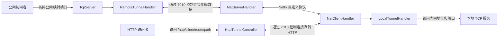

# shuai-tunnel

`shuai-tunnel` 是一个基于 Spring Boot 和 Netty 的 Java 内网穿透实验项目。它在公网服务端和内网客户端之间维护一条控制连接，并在收到映射配置后，将公网 TCP 端口上的流量转发到客户端可访问的本地服务。

> 当前仓库适合用于学习和继续开发，不建议直接用于生产环境。端到端隧道映射还缺少一个服务端配置下发入口，详见[当前状态](#当前状态)。

## 工作原理



核心流程：

1. `tunnel-server` 启动 Spring Boot 应用，并在 `7010` 端口监听客户端控制连接。
2. `tunnel-client` 读取工作目录下的 `tunnelClientConfig.json`，连接服务端并完成登录。
3. 服务端向客户端发送 `NAT_CONTROL` 消息后，客户端动态添加 `NatClientHandler` 并注册端口映射。
4. 服务端为每个公网映射端口创建一个 `TcpServer`。
5. 公网请求到达映射端口后，数据经控制连接转发至客户端，再由客户端连接目标内网服务。

## 模块结构

| 模块 | 说明 |
| --- | --- |
| `tunnel-common` | 公共协议、编解码器、登录鉴权、心跳、会话、消息和同步 HTTP 请求能力 |
| `tunnel-server` | 公网服务端，监听控制连接，并为已注册映射创建公网 TCP 监听端口 |
| `tunnel-client` | Java 内网客户端，连接服务端，并将隧道数据转发至目标内网服务 |
| `tunnel-client-go` | Go 内网客户端，与 Java 客户端使用相同配置和紧凑二进制协议 |

主要入口：

- 服务端：`tunnel-server/src/main/java/com/theshuai/tunnelserver/TunnelServerApplication.java`
- 客户端：`tunnel-client/src/main/java/com/theshuai/tunnelclient/TunnelClientApplication.java`
- Go 客户端：`tunnel-client-go/cmd/shuai-tunnel-client/main.go`
- 协议实现：`tunnel-common/src/main/java/com/theshuai/common/protocol/PacketCodec.java`

## 环境要求

- JDK 25
- Maven 3.x
- Go 1.26（仅构建 Go 客户端时需要）

根目录 `pom.xml` 将 Java 编译版本设置为 `25`。仓库中的 Maven Wrapper 脚本没有可执行权限，且未提交 `.mvn` 目录，因此建议使用本机安装的 Maven。

## 构建

在项目根目录执行：

```bash
mvn clean install
```

## 启动

### 1. 启动服务端

```bash
cd tunnel-server
mvn org.springframework.boot:spring-boot-maven-plugin:run
```

服务端会监听两个端口：

| 端口 | 用途 |
| --- | --- |
| `7010` | Netty 控制连接端口，定义在 `NettyServer` 中 |
| `8088` | Spring Boot Web 和管理后台端口，定义在 `application.yml` 中 |

启动后访问 [http://127.0.0.1:8088](http://127.0.0.1:8088) 可进入管理后台。默认管理账号为 `admin / admin`，部署前应通过 `TUNNEL_ADMIN_USERNAME` 和 `TUNNEL_ADMIN_PASSWORD` 修改。

服务端默认使用当前工作目录下的 SQLite 数据库 `shuai-tunnel.db`。持久化层使用 Spring Data JPA 和 Hibernate，不包含手写 SQL 或 `JdbcTemplate`。首次启动时 Hibernate 会自动维护表结构，并创建演示客户端 `Demo client / test1234`。管理后台提供幂等的初始化按钮，用于补齐种子数据，不会清空已有数据。

### 2. 配置并启动客户端

客户端从当前工作目录读取 `tunnelClientConfig.json`。在 `tunnel-client` 目录中创建或修改该文件：

```json
{
  "clientName": "Demo client",
  "password": "test1234",
  "httpTunnelConfigList": [
    {
      "route": "web",
      "targetBaseUrl": "http://127.0.0.1:8080"
    }
  ],
  "remoteAddress": "127.0.0.1",
  "remotePort": 7010
}
```

字段说明：

| 字段 | 说明 |
| --- | --- |
| `clientName` | 客户端名称，也是服务端会话标识 |
| `password` | 管理后台分配给客户端的密码 |
| `tunnelConfigList` | TCP 端口映射列表；Go 客户端会在登录后直接注册，Java 客户端通过 `NAT_CONTROL` 消息动态接收 |
| `httpTunnelConfigList` | HTTP 直转路由列表；每个 route 映射一个客户端可访问的内网 HTTP 地址 |
| `remoteAddress` | 公网服务端地址 |
| `remotePort` | 服务端 Netty 控制连接端口，当前代码固定为 `7010` |

启动客户端：

```bash
cd tunnel-client
mvn org.springframework.boot:spring-boot-maven-plugin:run
```

也可以使用 Go 客户端。它不依赖 Java 运行时，并会在登录成功后直接注册配置文件中的 `tunnelConfigList`：

```bash
cd tunnel-client-go
cp tunnelClientConfig.example.json tunnelClientConfig.json
go run ./cmd/shuai-tunnel-client -config tunnelClientConfig.json
```

构建单文件客户端：

```bash
cd tunnel-client-go
go build -o shuai-tunnel-client ./cmd/shuai-tunnel-client
```

客户端的 `application.yml` 也将 Spring Boot Web 端口设置为 `8088`。如果服务端和客户端在同一台机器上联调，需要为客户端覆盖该端口：

```bash
mvn org.springframework.boot:spring-boot-maven-plugin:run \
  -Dspring-boot.run.arguments=--server.port=8089
```

### 3. 下发端口映射

Java 客户端收到 `NAT_CONTROL` 消息后，才会注册端口映射。Go 客户端既支持相同的动态配置消息，也会在登录后直接注册本地配置文件中的 `tunnelConfigList`。消息体应为以下 JSON 结构：

```json
{
  "clientName": "Demo client",
  "remoteAddress": "127.0.0.1",
  "remotePort": 7010,
  "tunnelConfigList": [
    {
      "port": 9000,
      "tunnelAddress": "127.0.0.1",
      "tunnelPort": 8080
    }
  ]
}
```

该示例表示：访问服务端 `9000` 端口的 TCP 流量，将被转发到客户端网络中的 `127.0.0.1:8080`。

## 协议概览

控制连接使用自定义二进制协议：

| 字段 | 长度 | 说明 |
| --- | --- | --- |
| `magic` | 4 字节 | 固定值 `0x14353565` |
| `version` | 1 字节 | 协议版本 |
| `serializer` | 1 字节 | 序列化算法 |
| `command` | 1 字节 | 消息指令 |
| `length` | 4 字节 | 消息体长度 |
| `body` | N 字节 | 消息体 |

当前已定义登录、退出、心跳、普通消息、同步 HTTP 请求和 NAT 隧道消息。NAT 隧道消息支持注册、连接建立、断开、数据转发和保活。

普通控制消息默认使用紧凑二进制序列化：省略字段名，使用变长整数、短类型标记，并在消息体较大且压缩后更小时启用 Deflate。NAT 数据帧保留已有的专用布局，但隧道字节流也会在确实能够缩小时启用 Deflate。由于默认序列化算法和 NAT 数据封装已经变更，服务端和客户端需要同步升级。

## 管理后台

内置管理后台支持：

- 创建、编辑、停用和删除客户端
- 自动生成客户端密码，或在管理页面中重置密码
- 查看控制连接成功和失败记录
- 按客户端和 UTC 日期汇总上下行流量
- 配置每个客户端每分钟允许的控制连接次数；设置为 `0` 表示不限
- 手动执行幂等数据库初始化

密码在数据库中保存为 SHA-256 摘要。创建或重置密码时，管理页面仅显示一次明文密码。

## HTTP 直转通道

HTTP 直转通道与 TCP 端口映射并行工作。服务端收到请求后，通过客户端控制连接转发 HTTP 方法、路径、查询参数、请求头和二进制请求体；客户端请求本地配置的目标服务，再将状态码、响应头和二进制响应体返回。

客户端配置中的 `route` 决定可访问的内网目标。例如：

```json
{
  "httpTunnelConfigList": [
    {
      "route": "web",
      "targetBaseUrl": "http://127.0.0.1:8080"
    }
  ]
}
```

客户端登录后，可通过服务端直接访问：

```bash
curl -i http://127.0.0.1:8088/http/Demo%20client/web/api/hello?source=tunnel
```

该请求会转发到客户端网络中的 `http://127.0.0.1:8080/api/hello?source=tunnel`。`/http/**` 默认作为公开流量入口，不使用管理后台的 Basic Auth；只有客户端配置过的 route 可以被访问。单次请求体默认限制为 `16 MiB`，可通过 `TUNNEL_HTTP_MAX_REQUEST_BODY_SIZE` 调整。转发超时默认是 `30000` 毫秒，可通过 `TUNNEL_HTTP_TIMEOUT_MS` 调整。

### 数据库切换

默认配置使用 SQLite：

```bash
TUNNEL_DB_URL=jdbc:sqlite:./shuai-tunnel.db \
TUNNEL_DB_DRIVER=org.sqlite.JDBC \
TUNNEL_DB_DIALECT=org.hibernate.community.dialect.SQLiteDialect \
mvn org.springframework.boot:spring-boot-maven-plugin:run
```

切换至 MySQL：

```bash
TUNNEL_DB_URL=jdbc:mysql://127.0.0.1:3306/shuai_tunnel \
TUNNEL_DB_DRIVER=com.mysql.cj.jdbc.Driver \
TUNNEL_DB_DIALECT=org.hibernate.dialect.MySQLDialect \
TUNNEL_DB_USERNAME=root \
TUNNEL_DB_PASSWORD=your-password \
TUNNEL_DB_POOL_SIZE=8 \
mvn org.springframework.boot:spring-boot-maven-plugin:run
```

切换至 PostgreSQL：

```bash
TUNNEL_DB_URL=jdbc:postgresql://127.0.0.1:5432/shuai_tunnel \
TUNNEL_DB_DRIVER=org.postgresql.Driver \
TUNNEL_DB_DIALECT=org.hibernate.dialect.PostgreSQLDialect \
TUNNEL_DB_USERNAME=postgres \
TUNNEL_DB_PASSWORD=your-password \
TUNNEL_DB_POOL_SIZE=8 \
mvn org.springframework.boot:spring-boot-maven-plugin:run
```

## 当前状态

已实现：

- 客户端登录、时间戳校验和心跳保活
- 基于 Spring Data JPA 和 Hibernate 的 SQLite、MySQL 和 PostgreSQL 持久化与初始化
- 客户端账号分配、连接记录、连接频率限制和流量统计
- 内置管理 API 和管理页面
- 基于客户端 route 白名单的 HTTP 请求直接转发
- 控制连接断开后的重连逻辑
- TCP 公网端口监听和双向数据转发
- 服务端通过控制连接请求客户端发起 HTTP 请求，并同步等待响应
- 与 Java 协议兼容的 Go 客户端，支持登录、心跳、自动重连、TCP 映射和 HTTP 直转

需要继续完善：

- 仓库中没有 Controller、命令行入口或管理界面用于向 Java 客户端发送 `NAT_CONTROL` 消息；Go 客户端可以通过本地配置文件直接注册端口映射。
- 服务端和客户端的 Spring Boot Web 端口默认均为 `8088`，部署在同一台机器时需要覆盖其中一个端口。
- UDP 转发尚未实现，`UdpConnection` 当前为空。
- 登录签名盐值仍写在代码中，MD5 签名仅适合演示。
- 自动化测试仍需要补充真实 MySQL、PostgreSQL 和端到端隧道覆盖。

## 开发建议

下一步可以优先增加一个服务端管理接口，用于选择在线客户端并下发 `NAT_CONTROL` 配置；随后将签名升级为更安全的方案，并补充端到端测试。
