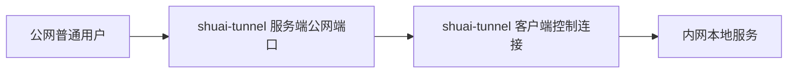
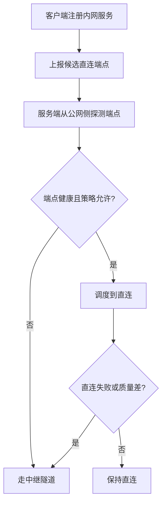

# 内网服务尽量直连方案讨论纪要

> 历史基线：本文形成于 `57f1a67`（2026-06-16），用于记录方案选择过程，文中的“当前项目”不代表
> 2026-07-10 的实现状态。Peer Mesh 的 UDP direct、标准 STUN/TURN relay、TUN/Wintun/utun 和管理面现已落地；
> 当前行为见 `peer-mesh-implementation.md` 与 `../../protocol/spec/peer-mesh.md`。

> 目标：整理“公网普通用户访问内网服务时也尽量直连”的技术边界、PCDN/Surge Ponte 的实现启发，以及 `shuai-tunnel` 后续可落地的演进路线。
>
> 本文是设计讨论记录，不代表当前代码已经实现这些能力。

## 1. 核心结论

- 当前 `shuai-tunnel` 的主模型是反向隧道：内网客户端主动连公网服务端，公网用户访问服务端暴露的端口，再由服务端中继到内网客户端。
- 真正的 NAT 打洞需要连接双方都参与信令、探测和建连。普通公网用户通常只是浏览器、curl、SSH 客户端或任意 TCP 客户端，没有安装我们的 agent，因此无法对“任意普通用户”透明地做 P2P 打洞。
- 对普通公网用户来说，“尽量直连”的可行含义不是让用户临时参与打洞，而是优先把用户引导到一个已经可公网访问的直连端点：
  - 原生公网 IP。
  - IPv6 公网地址。
  - 用户手工端口转发。
  - UPnP / NAT-PMP / PCP 自动端口映射。
  - 云厂商安全组或边缘节点暴露。
- 如果没有任何可公网访问的直连端点，就必须回退到中继隧道。
- 对“双方都安装 agent”的私有网络场景，才可以设计类似 Surge Ponte、Tailscale、ZeroTier 的 NAT 穿透和 relay fallback。

## 2. 当前项目的流量模型

当前模式：



优点：

- 公网用户不需要安装任何客户端。
- 只要求内网机器能主动访问公网服务端。
- 对 TCP 服务比较通用。

代价：

- 所有流量都经过公网服务端，服务端承担带宽、连接数和延迟压力。
- 单个客户端控制连接可能成为吞吐瓶颈。
- 直连能力弱，除非额外发现并验证内网侧可公网访问的端点。

## 3. “打洞”为什么不能直接服务普通公网用户

NAT 打洞的典型前提：

- 两端都知道彼此的候选地址。
- 两端都能向 STUN / 信令服务上报自己的公网映射。
- 两端都能按约定同时向对方公网映射发包。
- 两端都能保持 NAT 映射活跃。
- 失败时能切换到 relay。

这意味着公网访问者也必须运行我们的协议逻辑。普通浏览器或普通 TCP 客户端做不到这些事，尤其是：

- 浏览器不能任意发起原始 TCP/UDP 打洞。
- SSH、MySQL、Redis、HTTP 客户端不会配合我们的信令流程。
- TCP 打洞本身比 UDP 更难，受 NAT、防火墙和操作系统行为影响更大。
- 对称 NAT、运营商 CGNAT、企业防火墙下成功率会明显下降。

所以，面向普通公网用户时，打洞不是主路径；直连端点发现、健康探测、调度切流和中继兜底才是主路径。

## 4. 面向普通用户的“直连优先”模型

推荐把可用链路分成三类：

| 类型 | 适用对象 | 是否需要公网用户安装 agent | 说明 |
| --- | --- | --- | --- |
| Relay | 所有普通用户 | 否 | 当前模式，稳定兜底 |
| Direct Endpoint | 所有普通用户 | 否 | 用户访问已被验证可达的公网/IPv6/映射端口 |
| P2P / Hole Punching | 受控客户端或私有设备 | 是 | 双方都参与信令和穿透 |

直连优先的工程流程：



候选直连端点来源：

- 手工配置：用户自己做端口转发，然后把公网地址/域名/端口配置到客户端。
- IPv6：客户端检测自身 IPv6 地址，服务端探测可达性。
- UPnP / NAT-PMP / PCP：客户端尝试向家庭路由器申请端口映射。
- 公网机器部署客户端：天然公网可达。
- 边缘节点：类似 PCDN/CDN，把请求调度到健康的近端节点。

## 5. HTTP 与普通 TCP 的差异

HTTP 场景可以更灵活：

- 服务端收到请求后，可以在直连端点健康时返回 302/307 跳转。
- 也可以通过 DNS 调度，把用户域名解析到直连端点。
- 也可以用反向代理按 Host/path 做策略。

但要注意：

- HTTPS 直连需要证书、域名和 SNI 配合。
- 302 会改变用户实际访问地址，可能影响 Cookie、CORS、回调 URL 和 Host 语义。
- DNS 切流有 TTL、生效延迟和失败回滚问题。

普通 TCP 场景更受限：

- 用户一旦已经连到服务端公网端口，服务端无法在 TCP 层透明地把这条连接“改道”到内网直连端点。
- 直连选择必须发生在连接建立之前，例如 DNS、客户端 SDK、连接配置、专用调度入口。
- 如果没有协议层 redirect 能力，relay 仍然是最通用的入口。

## 6. PCDN 的启发

PCDN 不是让任意 NAT 后面的节点都神奇地被公网用户直连，而是一个调度和缓存系统：

- 有调度中心，持续掌握节点在线状态、地域、运营商、带宽、负载和健康度。
- 节点通常要具备可达性，或者至少被受控 SDK/客户端访问。
- 内容通常会被切成分片、Range 或对象缓存，用户从多个健康节点获取内容。
- 节点不可用时回源或走中心化 CDN/relay。
- 需要准入、限速、鉴权、审计和质量评分，避免把用户流量调度到不可控或不稳定节点。

对 `shuai-tunnel` 的启发：

- 可以引入“候选端点 + 健康探测 + 调度 + fallback”的模型。
- 可以统计每个端点的可用率、延迟、失败率和带宽。
- 对普通 TCP 隧道，不应该直接照搬 PCDN 的缓存模型；除非未来支持 HTTP 静态资源、文件分发或对象缓存。

## 7. Surge Ponte 的启发

Surge Ponte 是 Surge 设备之间的私有网络能力，不是面向任意公网用户的通用入站穿透。

根据 Surge 官方文档：

- Ponte 用于 Surge Mac 和 iOS 设备之间组建私有网络。
- Mac 可以作为服务端和客户端，iOS 只能作为客户端。
- Ponte 会自动选择合适通道，包括局域网直连、NAT traversal、代理辅助 traversal、静态端口转发。
- 直接 NAT traversal 对 NAT 类型要求较高，官方文档指出 Full Cone NAT 才适合无代理直连。
- 代理辅助 traversal 依赖支持 UDP relay 的代理。
- 设备信息和密钥通过 iCloud 同步，数据链路端到端加密。
- `.sgponte` 虚拟域名和 `DEVICE` 策略用于把访问路由到指定设备。
- 底层代理协议提到 Vector。

官方参考：

- [Surge Ponte Guide](https://kb.nssurge.com/surge-knowledge-base/guidelines/ponte)
- [Surge NAT Types](https://kb.nssurge.com/surge-knowledge-base/technotes/nat-type)
- [Surge Manual](https://manual.nssurge.com/)

对 `shuai-tunnel` 的启发：

- 把“控制面”和“数据面”分开。
- 控制面负责设备身份、密钥、候选地址、NAT 类型、健康状态和策略。
- 数据面按优先级选择：LAN direct -> public direct -> NAT traversal -> relay。
- 所有直连都必须有 relay fallback。
- 不要把 Ponte 模型误用到普通公网用户场景；它更适合“用户自己的多设备互联”或“双方都部署 agent”的场景。

## 8. 后续可落地路线

### 8.1 P0：手工直连端点注册

目标：先支持最确定、最容易验证的直连能力。

建议：

- 客户端配置每个映射的 `directEndpoints`。
- 服务端保存候选端点，并从公网侧定期探测。
- 管理页展示端点状态、延迟、最近失败原因。
- HTTP 映射可以先支持 302/307 跳转或调度提示。
- TCP 映射先不做透明切流，只提供可查询的直连地址或后续 DNS/SDK 调度能力。

示例配置方向：

```yaml
tunnel:
  mappings:
    - remote-port: 18080
      local-host: 127.0.0.1
      local-port: 8080
      direct-endpoints:
        - host: example-user-home.example.com
          port: 28080
          protocol: tcp
          source: manual
```

### 8.2 P1：IPv6 直连探测

目标：如果内网服务所在机器有公网 IPv6，优先尝试 IPv6 直连。

建议：

- 客户端检测可用 IPv6 地址。
- 服务端从公网侧发起 TCP 探测。
- 探测通过后加入候选端点。
- 支持 per-mapping 开关，避免意外暴露内网服务。

### 8.3 P1：UPnP / NAT-PMP / PCP 自动映射

目标：家庭网络下自动申请端口映射，提高普通用户直连概率。

建议：

- 默认关闭，用户显式开启。
- 支持端口续租和释放。
- 服务端必须二次探测确认。
- 管理页清楚展示已暴露端口和安全风险。
- 失败时静默回退 relay。

风险：

- 路由器兼容性差异大。
- 企业网络和 CGNAT 下通常不可用。
- 自动开端口有安全风险，需要鉴权、日志和清晰提示。

### 8.4 P2：受控 agent 之间的 NAT traversal

目标：为“双方都运行 shuai-tunnel agent”的场景支持真正打洞。

建议：

- 引入 UDP/STUN 探测，记录 NAT 类型和候选地址。
- 优先支持 UDP/QUIC 数据通道，TCP 仍以 relay 为主。
- 控制面协调双方同时建连。
- 失败后自动 fallback relay。
- 可以参考 ICE 思路，但保持实现范围克制。

适用场景：

- 私有设备互联。
- 客户端到客户端访问。
- SDK/桌面端/移动端都受控的产品形态。

不适用场景：

- 任意浏览器直接访问任意内网 TCP 服务。
- 未安装 agent 的普通 SSH/MySQL/Redis 客户端。

## 9. 需要提前设计的安全边界

- 直连端点不能默认暴露，必须显式开启。
- 服务端探测需要防止被滥用成端口扫描器。
- 端点注册需要绑定客户端身份和映射权限。
- HTTP 跳转要考虑 Host、TLS 证书、Cookie、CORS 和回调地址。
- TCP 直连地址泄露后，服务端将不再位于数据路径上，需要内网服务自身具备鉴权能力。
- UPnP 自动开端口必须有审计和可关闭能力。
- 需要记录 direct/relay 的流量归因，否则后续排障会很困难。

## 10. 建议新增观测指标

- 候选直连端点数量。
- 端点探测成功率、延迟和最近失败原因。
- direct 命中次数、relay fallback 次数。
- direct/relay 分别的连接数、字节数和错误数。
- 每个 NAT 类型的穿透成功率。
- UPnP 映射成功率和续租失败次数。
- 用户因直连失败回退 relay 的比例。

## 11. 尚待确认的问题

- 项目是否要区分 HTTP 映射和原始 TCP 映射？直连调度在 HTTP 下更容易落地。
- 是否要提供一个查询 API，让调用方/SDK 在连接前拿到最佳入口？
- 是否要维护 DNS 调度能力，还是先只做 HTTP redirect / 管理页提示？
- 是否接受客户端自动开启 UPnP 端口映射？
- 是否计划支持“双方都安装 agent”的私有网络模式？
- 如果引入 UDP/QUIC 数据通道，是否会影响当前纯 TCP 隧道的设计边界？

## 12. 推荐下一步

短期最稳的方向：

1. 先做手工 `directEndpoints` 注册和服务端健康探测。
2. HTTP 映射先支持直连跳转或直连地址提示。
3. TCP 映射保持 relay 兜底，不承诺透明切流。
4. 管理页增加 direct/relay 状态和探测结果。
5. 在此基础上再评估 IPv6、UPnP 和 agent-to-agent NAT traversal。

这条路线能先让“已经具备公网可达条件”的用户吃到直连收益，同时不破坏当前反向隧道的通用性。
