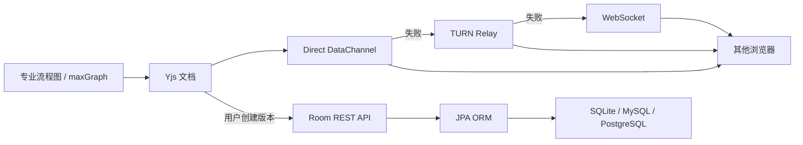

# 专业流程图完整功能改造说明

> 更新时间:2026-07-13
>
> 状态:持续建设
>
> 范围:互传页面中的“专业流程图”、房间协作、权限、版本与持久化
>
> 对标方向:ProcessOn / draw.io 一类可用于真实工作的专业流程图工具

本文统一记录专业流程图改造的目标、当前实现、已知边界、未实现功能、后续顺序和验收标准。文中的“已实现”表示**当前工作区代码已具备并经过现有自动化验证**，不等同于已经提交、部署到生产或完成全部真机验收。

## 1. 改造目标

完整目标不是复刻某个产品的界面，而是形成一套可独立使用的专业图形文档能力:

* 提供流程图、BPMN、UML / ER、架构图等常见绘图能力。
* 支持多页面、复杂图形编辑、图层、模板和可复用图形库。
* 支持多人实时协作、评论、成员角色、版本历史与故障恢复。
* 优先通过 Direct P2P 传输协作数据，失败后依次回退 TURN 和 WebSocket。
* 支持本地文件、draw.io、Visio、Mermaid、PlantUML 和常用图片 / PDF 格式交换。
* 默认 SQLite，兼容 MySQL 和 PostgreSQL；服务端持久化统一使用 JPA ORM，不引入 JDBC 手写数据访问。
* 自由白板与专业流程图保持为两种独立文档模型，避免无限画布笔迹和结构化图形互相污染。

## 2. 状态定义

| 标记 | 含义 |
|---|---|
| ✅ | 当前工作区已实现，已有代码或自动化测试依据 |
| 🟡 | 已实现主体能力，但仍有明确边界或缺少生产验收 |
| ⬜ | 尚未实现，属于后续目标 |

## 3. 当前架构

### 3.1 前端

* `apps/admin-web/src/components/SyncedDiagram.tsx`:专业流程图编辑器、协作状态、评论、版本和导入导出入口。
* `apps/admin-web/src/components/SyncedWhiteboard.tsx`:自由白板 / 专业流程图宿主与协作消息分发。
* `apps/admin-web/src/pages/PublicTransferPage.tsx`:内网 / 外网房间、成员发现、角色与邀请管理。
* `apps/admin-web/src/lib/diagramDocument.ts`:`.stdg` 文档模型、Yjs 更新编码和输入校验。
* `apps/admin-web/src/lib/diagramDrawio.ts`:draw.io 多页面导入导出。
* `apps/admin-web/src/lib/diagramTextFormats.ts`:Mermaid / PlantUML 子集导入导出。
* `apps/admin-web/src/lib/diagramVisio.ts`:Visio VSDX 导入和 VDX 导出。
* `apps/admin-web/src/hooks/useDirectTransfer.ts`:Direct / TURN 数据通道能力，WebSocket 由发现通道兜底。

编辑器使用 maxGraph 负责图形渲染和交互，使用 Yjs 保存节点、连线、页面和评论等协作状态。浏览器间传递的是 Yjs 增量更新；新加入设备可以请求完整状态。

### 3.2 服务端

* `PublicTransferDiscoveryWebSocketHandler`:房间发现、WebSocket 信令 / 数据兜底、角色写权限拦截和可信成员清单。
* `PublicTransferRoomService`:房间身份解析、邀请 Token、角色授权和流程图版本。
* `PublicTransferRoomResource`:房间邀请和流程图版本公开 API。
* `PublicTransferRoom`、`PublicTransferRoomAccess`、`PublicTransferDiagramVersion`:JPA ORM 实体。

当前数据库只保存房间、邀请凭证和用户主动创建的版本快照，**尚未持续保存正在编辑的最新流程图文档**。



## 4. 当前已实现功能

### 4.1 图形编辑

| 能力 | 状态 | 当前实现 |
|---|---|---|
| 基础节点 | ✅ | 开始、处理、判断、结束、文档、数据库、参与者、注释 |
| BPMN 基础图形 | ✅ | 子流程、数据、延迟、事件、网关；目前是图形级支持，不是完整 BPMN 语义引擎 |
| UML / ER 基础图形 | ✅ | UML 类、ER 实体；支持文本表达，尚无字段级建模器 |
| 架构图形 | ✅ | 服务器、消息队列、云服务 |
| 容器与泳道 | ✅ | 容器、水平 / 垂直泳道、节点归组与取消组合 |
| 拖放与端口连线 | ✅ | 图形面板拖入画布，节点四向端口连接 |
| 连线样式 | ✅ | 直线、正交、肘形、曲线；起止箭头、虚线、颜色、宽度 |
| 多选与框选 | ✅ | 多选、复制、粘贴、副本、删除、组合和取消组合 |
| 层级操作 | ✅ | 前移 / 后移、锁定 / 解锁节点 |
| 对齐与分布 | ✅ | 左 / 中 / 右、顶 / 中 / 底对齐，水平 / 垂直等距分布 |
| 自动布局 | ✅ | 从上到下、从左到右的层次布局 |
| 样式编辑 | ✅ | 填充、描边、线宽、虚线、圆角、阴影、透明度、旋转、字体、粗体、斜体和文字对齐 |
| 格式刷 | ✅ | 复制单个元素格式并应用到其他选中元素 |
| 撤销 / 重做 | ✅ | 基于 Yjs UndoManager，支持常用快捷键 |
| 右键菜单 | ✅ | 提供常用选择和结构操作 |
| 缩放与视图 | ✅ | 放大、缩小、适应、100%、小地图、全屏编辑 |
| 网格与辅助线 | ✅ | 网格、吸附和编辑辅助线 |
| 模板 | 🟡 | 已有内置模板插入；缺少模板中心、团队模板和自定义模板管理 |

### 4.2 文档组织

| 能力 | 状态 | 当前实现 |
|---|---|---|
| 多页面 | ✅ | 新增、切换、重命名、复制和删除页面，最多 50 页 |
| 文档上限 | ✅ | 最多 1,000 节点、2,000 连线、2,000 评论；`.stdg` 默认上限 2 MB |
| 页面级评论 | ✅ | 评论可挂在当前页面 |
| 元素级评论 | ✅ | 评论可关联节点或连线，并支持已解决状态 |
| 本地编辑缓存 | 🟡 | 当前页面生命周期内有内存缓存；刷新、崩溃或所有成员离线后不保证恢复最新状态 |
| 搜索与大纲 | ⬜ | 尚无跨页面元素搜索、替换和文档大纲树 |
| 图层 | ⬜ | 尚无图层面板、图层显隐、锁定、排序和跨层移动 |

### 4.3 实时协作

| 能力 | 状态 | 当前实现 |
|---|---|---|
| Yjs 增量同步 | ✅ | 节点、连线、页面、评论等以增量方式同步 |
| 初始全量同步 | ✅ | 新成员可请求当前完整 Yjs 状态 |
| 传输优先级 | ✅ | Direct 优先，ICE 失败时走 TURN，最后使用 WebSocket |
| 在线状态 | ✅ | 显示连接状态、设备数量和成员清单 |
| 远端光标 / 选区 | ✅ | 协作者 presence 可在流程图中显示 |
| 消息校验 | ✅ | 协作消息有类型、大小、房间和重复消息校验 |
| 房间隔离 | ✅ | WebSocket 按房间隔离；P2P 接收端依据服务端可信成员清单校验来源 |
| 离线合并 | 🟡 | Yjs 支持短时离线后的 CRDT 合并，但没有服务端最新文档作为长期离线恢复源 |
| 协作者列表详情 | 🟡 | 有在线设备和角色；缺少成员档案、操作状态和精细协作面板 |

### 4.4 房间权限

| 能力 | 状态 | 当前实现 |
|---|---|---|
| 自定义房间名和 Token | ✅ | 外网房间支持自定义，首次有效 Token 创建房间并成为 OWNER |
| OWNER | ✅ | 可编辑、创建邀请、撤销邀请、创建 / 恢复 / 删除版本 |
| EDITOR | ✅ | 可编辑、评论、创建 / 恢复版本，不能管理邀请或删除服务端版本 |
| VIEWER | ✅ | 前端只读，WebSocket 服务端拒绝写消息，DataChannel 接收端也拒绝其写更新 |
| 邀请 Token | ✅ | OWNER 可创建 EDITOR / VIEWER Token，明文仅创建时返回，数据库保存哈希 |
| 撤销邀请 | 🟡 | 撤销后新连接和重连会失败；已在线连接不会立即被踢下线 |
| 邀请数量 | ✅ | 每个房间最多 20 个有效邀请 Token |
| 成员管理 | ⬜ | 尚无角色修改、移除在线成员、所有权转移和成员备注 |
| 邀请策略 | ⬜ | 尚无过期时间、使用次数、一次性邀请和指定成员绑定 |

说明:P2P DataChannel 内容不经过服务端，服务端无法直接检查加密直连数据。当前权限依赖双方使用受信客户端，并在接收端依据服务端 roster 校验 `sourceRole`。这能约束正常客户端和大部分伪造消息，但不能替代端到端签名、成员密钥轮换和实时吊销。

### 4.5 版本历史

| 能力 | 状态 | 当前实现 |
|---|---|---|
| 手动创建版本 | ✅ | OWNER / EDITOR 可命名并保存当前 Yjs 完整更新 |
| 服务端版本列表 | ✅ | 外网 Token 房间从服务端读取元数据，按需加载快照 |
| 恢复版本 | ✅ | OWNER / EDITOR 可把历史快照恢复为当前协作状态 |
| 删除版本 | ✅ | 只有 OWNER 可删除服务端版本 |
| 数量与大小限制 | ✅ | 每房间最多 50 个服务端版本，单快照最大 3 MB |
| 内网会话版本 | 🟡 | 无服务端房间时仅在本次浏览器会话保存最多 20 个版本 |
| 自动版本 | ⬜ | 尚无定时、里程碑或操作阈值自动版本 |
| 恢复保护 | ⬜ | 恢复前不会自动创建“恢复前备份” |
| 版本预览 / 差异 | ⬜ | 尚无缩略图、节点级 diff、重命名、说明、置顶和筛选 |

### 4.6 导入导出

| 格式 | 导入 | 导出 | 当前边界 |
|---|---:|---:|---|
| shuai-tunnel `.stdg` | ✅ | ✅ | 原生 JSON 文档，校验节点、连线、页面、评论和大小 |
| draw.io `.drawio` | ✅ | ✅ | 支持未压缩和压缩 XML、多页面及常用样式；复杂插件图形可能降级 |
| Mermaid | ✅ | ✅ | 支持流程图常用子集，不是 Mermaid 全语法执行器 |
| PlantUML | ✅ | ✅ | 支持当前解析器覆盖的图形子集，不包含完整 UML 语法 |
| Visio `.vsdx` | ✅ | ⬜ | 导入页面、基础形状和动态连接；复杂母版、主题和数据图形会降级 |
| Visio `.vdx` | ✅ | ✅ | 输出可由 Visio 打开的 XML Drawing，不是 VSDX 原样回写 |
| SVG | 不适用 | ✅ | 当前页矢量图片 |
| PNG | 不适用 | ✅ | 当前页 2 倍分辨率位图 |
| PDF | 不适用 | ✅ | 支持多页面导出 |

任何兼容格式都应按“可交换的支持子集”理解，目前不能保证与 draw.io / Visio 做像素级无损往返。

### 4.7 数据库与 API

| 能力 | 状态 | 当前实现 |
|---|---|---|
| ORM | ✅ | Spring Data JPA / Hibernate，无手写 JDBC |
| SQLite | ✅ | 默认数据库；已有 Hibernate 上下文测试覆盖新增实体映射 |
| MySQL / PostgreSQL | 🟡 | 实体与 JPA 设计可兼容，但本轮没有完成真实数据库集成测试 |
| 房间持久化 | ✅ | 保存房间名、OWNER Token 哈希、创建者和时间 |
| 邀请持久化 | ✅ | 保存角色、标签、Token 哈希、创建 / 撤销时间 |
| 版本持久化 | ✅ | 保存名称、作者、大小、时间和二进制 Yjs 快照 |
| 最新文档持久化 | ⬜ | 尚未保存房间当前 revision 和最新快照 |

当前房间 API:

```text
POST /api/public/transfer/rooms/access-tokens/list
POST /api/public/transfer/rooms/access-tokens
POST /api/public/transfer/rooms/access-tokens/{accessId}/revoke
POST /api/public/transfer/rooms/diagram/versions/list
POST /api/public/transfer/rooms/diagram/versions
POST /api/public/transfer/rooms/diagram/versions/{versionId}
POST /api/public/transfer/rooms/diagram/versions/{versionId}/delete
```

上述接口使用 `roomId + roomToken + peerId` 作为公开房间凭证。版本快照按需读取，列表接口不携带大字段。

## 5. 尚未实现的完整功能

### 5.1 P0:生产可用闭环

以下能力是“完整改造完成”前必须补齐的阻断项:

1. **最新文档自动持久化**:为房间保存当前 revision、压缩后的 Yjs 快照和更新时间，支持防抖保存与并发版本检查。
2. **全员离线恢复**:房间内所有浏览器关闭后，新设备进入仍能从服务端恢复最新文档，而不是只能恢复用户手动创建的历史版本。
3. **崩溃恢复**:周期 checkpoint、Yjs 更新压缩 / 合并、损坏快照回退和恢复告警。
4. **实时吊销**:撤销 Token、移除成员或修改角色后，服务端立即关闭对应 WebSocket，并通过成员 epoch 使旧 DataChannel 消息失效。
5. **成员管理**:角色修改、成员移除、OWNER 转移、在线会话管理和操作确认。
6. **恢复前保护版本**:恢复历史版本前自动生成备份，避免误操作覆盖当前文档。
7. **数据库矩阵**:SQLite、MySQL、PostgreSQL 的建表、LOB、索引、事务和迁移集成测试全部通过。
8. **真实链路验收**:至少两台桌面设备和一台移动设备分别覆盖 Direct、TURN、WebSocket 三条路径及 VIEWER 越权用例。

### 5.2 P1:专业编辑器完整度

* 图层面板:新增、删除、重命名、排序、显隐、锁定、跨层移动。
* 自定义图形库:SVG 图形导入、个人 / 团队图形库、图标搜索、收藏和版本管理。
* 模板中心:分类、预览、搜索、自定义模板、团队模板和一键从模板创建。
* 富文本节点:段落、列表、链接、代码块、公式和节点内表格。
* 表格与数据模型:可编辑表格、UML 属性 / 方法、ER 字段 / 类型 / 主外键和关系基数。
* 完整 BPMN:事件类型、任务类型、网关语义、消息流 / 顺序流、池与泳道约束及模型校验。
* 完整 UML:类图、时序图、用例图、组件图和部署图的专用编辑体验。
* 高级连线:可视化折点编辑、线桥、避障、吸附优先级、连接标签位置和多段线控制。
* 更多布局:正交、径向、树形、力导向、紧凑布局以及选区局部布局。
* 页面链接:元素超链接、跨页面跳转、锚点、返回导航和链接导出。
* 元素属性:业务元数据、自定义字段、标签、负责人、状态和外部链接。
* 搜索与大纲:跨页面搜索 / 替换、按类型筛选、层级树和快速定位。
* 标尺与打印:标尺、页面尺寸、页边距、分页预览、打印区域和打印样式。
* 数据驱动:CSV / JSON 导入生成图、数据绑定、批量更新和条件样式。

### 5.3 P1:版本与协作体验

* 自动版本策略和保留策略。
* 版本缩略图、名称修改、说明、标签、置顶和作者筛选。
* 节点 / 连线 / 页面级差异比较，支持选择性恢复。
* 评论回复、@成员、未读状态、评论筛选和通知。
* 协作者跟随、正在编辑提示、冲突提示和演示模式。
* 邀请过期时间、最大使用次数、一次性 Token 和二维码邀请。
* 服务端审计日志:成员、权限、版本、导入、导出、恢复和删除事件。

### 5.4 P2:企业与规模化能力

* 管理端房间 / 成员 / 版本 / 存储占用页面。
* 房间、版本、图片资产和协作流量配额。
* 文档归档、回收站、保留周期、合规删除和导出审计。
* 大快照外置对象存储、数据库仅存索引和校验信息。
* 多实例房间路由、共享 presence、跨节点 WebSocket 广播和限流。
* 指标与告警:在线协作者、更新速率、保存延迟、快照大小、恢复失败和格式导入失败。
* 元素级 ACL、审批流、只允许评论和只允许查看部分页面等高级权限。
* Go / C# 服务端的房间、角色、版本和最新文档 API 对齐。
* 无障碍、完整键盘操作、国际化和移动端触控手势专项优化。

## 6. 目标数据模型

### 6.1 已存在

* `public_transfer_room`:房间身份与 OWNER 凭证。
* `public_transfer_room_access`:EDITOR / VIEWER 邀请凭证。
* `public_transfer_diagram_version`:用户主动创建的版本快照。

### 6.2 计划新增

| 表 | 用途 | 关键字段建议 |
|---|---|---|
| `public_transfer_diagram_document` | 房间最新文档 | `room_id`、`revision`、`snapshot_data`、`snapshot_hash`、`updated_at`、`updated_by_peer_id` |
| `public_transfer_diagram_checkpoint` | 自动恢复点 | `room_id`、`revision`、`reason`、`snapshot_data`、`created_at`、`expires_at` |
| `public_transfer_diagram_asset` | 图片和自定义图形 | `room_id`、`content_type`、`size_bytes`、`sha256`、`storage_key`、`created_at` |
| `public_transfer_diagram_audit` | 权限和文档审计 | `room_id`、`actor_peer_id`、`action`、`target_id`、`detail_json`、`created_at` |

所有新增数据访问继续通过 JPA Repository / Entity 完成。大快照和图片达到阈值后应转对象存储，数据库保留对象键、大小和哈希，避免无限增长的 LOB 拖慢备份和查询。

## 7. 后续 API 草案

以下接口是目标设计，**当前尚未实现**:

```text
POST /api/public/transfer/rooms/diagram/document/get
POST /api/public/transfer/rooms/diagram/document/save
POST /api/public/transfer/rooms/diagram/document/checkpoint

POST /api/public/transfer/rooms/members/list
POST /api/public/transfer/rooms/members/{memberId}/role
POST /api/public/transfer/rooms/members/{memberId}/remove
POST /api/public/transfer/rooms/owner/transfer

POST /api/public/transfer/rooms/diagram/versions/{versionId}/rename
POST /api/public/transfer/rooms/diagram/versions/{versionId}/diff
POST /api/public/transfer/rooms/diagram/versions/{versionId}/restore
```

`document/save` 应携带 `baseRevision`，服务端使用乐观锁更新；冲突时返回服务端 revision 和状态向量，由客户端进行 Yjs 合并后重试，不能以最后写入覆盖整个文档。

## 8. 按顺序实施计划

### 阶段 0:当前基线

状态:✅ 当前工作区已完成。

* maxGraph 结构化编辑器和 Yjs 协作模型。
* 多页面、评论、基础模板、权限、邀请 Token 和手动版本。
* `.stdg`、draw.io、Mermaid、PlantUML、Visio 和图片 / PDF 交换。
* Direct → TURN → WebSocket 协作链路。

### 阶段 1:持久化与恢复

状态:⬜ 未开始。

1. 新增最新文档和 checkpoint ORM 实体、Repository、迁移与三数据库测试。
2. 增加文档 bootstrap、乐观锁保存、Yjs 合并和快照压缩。
3. 前端实现防抖自动保存、离线队列、重试和保存状态提示。
4. 实现恢复前备份、损坏快照回退和全员离线重进测试。

验收:所有协作者退出后重新进入，图形、页面、评论和样式完整恢复；并发保存不会丢节点。

### 阶段 2:成员与实时权限

状态:⬜ 未开始。

1. 增加成员管理、角色修改、移除和 OWNER 转移。
2. 引入成员 / Token epoch，角色改变时广播 roster 更新并关闭失效连接。
3. 给 Direct / TURN 协作消息增加服务端签发的短期成员凭证或签名。
4. 增加邀请有效期、次数和一次性使用策略。

验收:角色或 Token 被撤销后，目标会话在约定时间内失去写权限，旧直连消息不能继续写入。

### 阶段 3:版本中心

状态:⬜ 未开始。

1. 自动版本、保留策略和恢复前备份。
2. 缩略图、说明、标签、置顶和版本筛选。
3. Yjs / 文档模型差异计算和节点级可视化 diff。
4. 整页恢复、选择性恢复和恢复审计。

验收:可明确看到两个版本新增、删除、移动和改样式的元素，并能安全回滚。

### 阶段 4:专业编辑能力补齐

状态:⬜ 未开始。

1. 图层、自定义图形库和模板中心。
2. 富文本、表格、页面链接、元数据和搜索大纲。
3. 高级连线、更多布局、标尺和打印区域。
4. BPMN、UML / ER 专用模型与校验。

验收:常见业务流程图、系统架构图、泳道图、BPMN 流程和 ER 图不需要退回 draw.io 补画。

### 阶段 5:兼容性与性能

状态:⬜ 未开始。

1. 建立 draw.io、Visio、Mermaid、PlantUML 固定样例库和往返测试。
2. 对大图进行渲染分片、增量索引、视口裁剪、Yjs 压缩和资源释放。
3. 降低 maxGraph / 导出库首屏体积，按功能动态加载。
4. 完成桌面、Android、iOS 浏览器的触控和内存验收。

建议性能目标需经压测确认后固化:桌面端 1,000 节点 / 2,000 连线满足连续编辑，移动端打开 500 节点级文档不崩溃；现有文档上限不是性能达标证明。

### 阶段 6:运营与跨语言发布

状态:⬜ 未开始。

1. 管理页面、审计、配额、指标、告警和清理任务。
2. Go / C# 服务端协议与数据模型对齐。
3. SQLite / MySQL / PostgreSQL、单机 / 多实例部署矩阵验收。
4. 灰度、回滚、数据迁移和生产演练。

## 9. 完整完成定义

只有以下条件全部满足，才能把“专业流程图完整改造”标记为完成:

* [ ] 当前文档可以自动保存，所有成员离线后可恢复。
* [ ] Direct、TURN、WebSocket 三条协作链路均通过多设备验收。
* [ ] OWNER、EDITOR、VIEWER 在前端、WebSocket、P2P 和 REST API 上权限一致。
* [ ] 撤销 Token、修改角色和移除成员能够实时生效。
* [ ] 版本支持自动创建、预览、差异、恢复前备份和审计。
* [ ] 图层、自定义图形库、模板中心、富文本、表格、搜索和页面链接可用。
* [ ] BPMN、UML / ER 和高级连线达到定义好的支持范围并有格式校验。
* [ ] draw.io / Visio / Mermaid / PlantUML 样例库完成往返回归，已知降级有明确提示。
* [ ] SQLite、MySQL、PostgreSQL 均通过迁移、事务和大字段测试。
* [ ] 大图性能、移动端内存、断网恢复和多人并发达到验收指标。
* [ ] 管理、审计、配额、监控、备份和清理具备生产运维闭环。
* [ ] Go / C# 服务端的能力差异已消除，或文档明确限制其不提供该功能。

## 10. 当前验证基线

截至本文更新时间，当前工作区最近一次验证结果:

* 前端 Vitest:15 个测试文件、88 个测试通过。
* TypeScript 类型检查通过。
* 前端生产构建通过。
* Java 房间角色、版本、WebSocket、附件服务和 SQLite Hibernate 上下文目标测试通过。

尚未完成的验证:

* MySQL / PostgreSQL 真实实例集成测试。
* Direct、TURN、WebSocket 三路径多设备端到端验收。
* Android / iOS 大图、长时间协作和内存专项测试。
* 生产部署后的权限、版本和数据恢复演练。

## 11. 维护规则

* 新增功能时同时更新“当前已实现功能”和“尚未实现功能”，不得只修改路线图。
* 自动化测试通过不代表已部署；提交和部署状态应在发布记录中单独维护。
* 部分兼容格式必须写明支持子集，不使用“完全兼容”描述。
* 新增数据库表或查询必须使用 ORM，并补 SQLite、MySQL、PostgreSQL 方言验证。
* 每完成一个阶段，应把该阶段状态改为已完成，并把遗留问题移动到下一阶段或风险清单。
